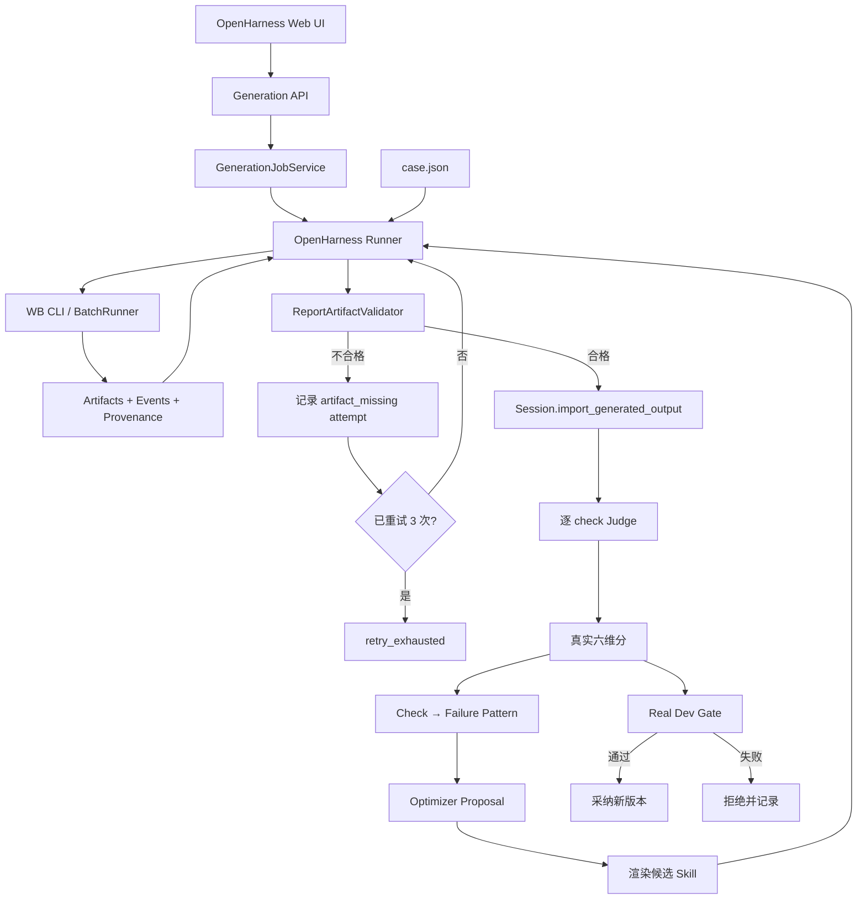
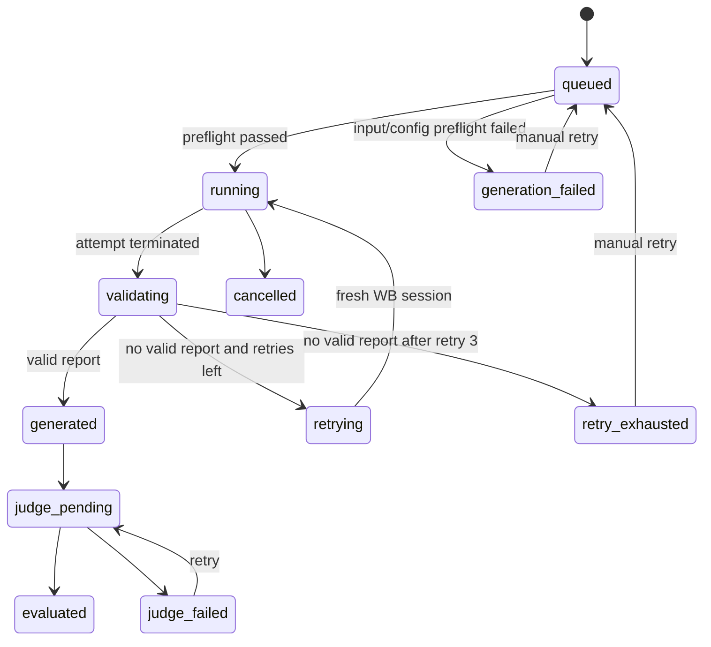

# OpenHarness × WB CLI 真实报告自动生成集成设计

> 状态：Phase 0 核心链路已实现
> 日期：2026-07-23
> 范围：设计、Phase 0 实现现状与后续开发拆解
> 目标：让 OpenHarness 能基于指定 Skill 版本，通过 WB CLI 自动生成真实报告，并接入真实 Judge、人工校准与后续真实优化闭环。

---

## 1. 结论先行

本次集成以 OpenHarness `Runner` 作为统一执行入口：由 Runner 负责读取 case、准备 Skill、调用 WB CLI、验收产物并返回标准化执行结果。

Runner 需要同时保留两条执行路径：

- Mock 路径：沿用当前 `run_split()`，执行确定性 Backend + Judge；
- Real 路径：新增 Runner 外部执行入口，调用内置
  `workbuddy_batch.BatchRunner` 自动生成真实报告。

推荐的目标架构是：

1. `harness/runner.py` 继续作为 Session/Loop 的统一执行门面；
2. 保留现有 `run_split()`，新增 `run_external_cases()`（名称可在实现时确定）；
3. Runner 的外部执行路径直接调用 WB CLI 模块；
4. 当前集成测试输入直接读取工作区根目录 `case.json`；
5. Runner 对 WB 产物做独立验收，不能只看 WB CLI `status=success`；
6. 没有有效报告时，Runner 记录失败 attempt，并从头重跑该 case，最多额外重试 3 次；
7. Runner 返回统一的 `ExternalRunResult`，Session 再把报告写入 `report_outputs`；
8. Web 如需异步，只在 Runner 外包一层任务调度，不改变“Runner 负责执行”的边界；
9. Judge 完成后才进入真实分数统计、失败归因和版本 Gate；
10. 后续再将真实逐 check 失败映射为 directive，形成真正的真实优化闭环。

建议按“先自动生成与评测，再做真实自动优化”分阶段建设，避免一次改动同时重写执行、状态、Judge、Optimizer 和前端。

### 1.1 2026-07-23 实现进度

已完成：

- `harness/runner.py` 增加真实外部执行 façade；
- `harness/workbuddy_runner.py` 实现预检、任务约束、执行、验收和条件重试；
- `harness/workbuddy_batch/` 内置 WB 多文件实现；
- `harness/external_run_models.py` 定义请求、attempt、case 和 batch 结果；
- `harness/report_artifact.py` 实现 required report 验收；
- `harness/run_external.py` 提供本地命令；
- `case.json` 增加三个 OpenHarness case ID/split 映射；
- Fake WorkBuddy 契约测试覆盖生成成功、重试成功、重试耗尽、CLI error 和材料预检；
- 原有 research/report 两条 Mock 优化回归通过。

尚未完成：

- SkillArtifact → 文件型 Skill 的版本化 Renderer；
- GenerationJobService、Web API 和 UI；
- 自动写入运行中 Session 的 `report_outputs`；
- 自动 Judge 与真实候选 Gate。

---

## 2. 当前两个系统的职责

### 2.1 OpenHarness 当前真实评测链路

当前流程是：

```text
人工/外部生成报告
    ↓
POST /api/import_output
    ↓
Session.report_outputs
    ↓
人工逐 check 标注 / POST /api/run_judge
    ↓
Session.judge_checks
    ↓
dim_from_checks() 汇总六维分
    ↓
分数曲线、校准、红线判断
```

关键事实：

- `SessionEval.evaluate()` 默认仍通过 `ResearchMockBackend` 生成基础记录；
- `_apply_recorded()` 再用真实报告和真实 Judge 分覆盖 Mock 结果；
- 如果有真实报告但还没有真实 Judge 分，当前实现会保留 Mock 分作为占位；
- Recorded 报告的 `signals={}`，当前 `clustering.cluster()` 无法从真实报告得到失败模式；
- Web 版 `Session.advance()` 当前仍用 Mock Backend 对候选 Skill 做 Dev Gate；
- 因此当前真实链路主要解决“真实报告评测与校准”，没有闭合到真实自动优化。

### 2.2 WB CLI 当前能力

WB CLI 当前已经完成：

- JSON / JSONL / CSV 数据集解析；
- 每个 case 独立 workspace；
- 输入文件或目录复制；
- 本地 Skill 自动放入 `.codebuddy/skills/<skill-name>`；
- 同一 case 多轮对话通过 `--session-id` / `--resume` 保持上下文；
- 多 case 并发与 repetition；
- case 总超时、无输出 stall timeout、进程组清理；
- stream-json 事件采集；
- 工具调用、模型、Token、原生 session 留档；
- 工作区变更和最终文件产物采集；
- 生成 `results.md`、`conversation.md`、manifest 和 trace。

当前主要调用链：

```text
dataset.load_cases
    ↓
CaseSpec / BatchConfig
    ↓
BatchRunner.run
    ↓
每个 case 建独立 workspace
    ↓
copy_inputs + stage_skills
    ↓
多轮调用 WorkBuddy CLI
    ↓
EventCollector 收集 stream-json
    ↓
collect_artifacts
    ↓
conversation / manifest / trace
```

---

## 3. 已观察到的真实运行问题

对现有 `workbuddy_batch_runs/` 的检查表明，当前必须区分三种成功：

1. WorkBuddy CLI 进程成功；
2. Agent 最后一轮回答成功；
3. 满足 OpenHarness 输出契约的报告文件成功生成。

这三者目前并不等价。

例如运行 `20260722T210613-525420`：

- 三个 case 在 `results.md` 中均显示 `success`；
- `case-02` 的 artifact manifest 有报告；
- `case-01` 和 `case-03` 的最终 artifact manifest 为空；
- `case-01` 最终只回复“已并行启动 4 个 Agent，等待返回”，但 WB CLI 仍将该轮标为成功；
- `case-03` 把完整报告放在最终文本中，但没有落为报告文件。

因此集成后不能直接执行：

```python
if wb_status == "success":
    import_output(...)
```

必须增加 OpenHarness 自己的“报告输出契约验收”。

---

## 4. 目标架构



### 4.1 分层边界

建议明确五层：

#### A. Runner Facade

Runner 是 OpenHarness 唯一执行入口，负责在 Mock 与 WorkBuddy 两种模式之间分派：

```python
def run_split(skill, cases, rubric, backend, run_id, human_labels=None):
    """现有确定性评测路径。"""

def run_external_cases(case_file, skill_snapshot, config):
    """读取 case.json，调用 WB CLI，返回标准化 ExternalRunResult。"""
```

Session、Loop 和 Web API 都只调用 Runner，不直接 import WB CLI。

#### B. Runner 内部 WorkBuddy Adapter

Runner 内部负责：

- 调用 `workbuddy_batch.dataset.load_cases(case.json)`；
- 组装/覆盖 `BatchConfig`；
- 注入当前 OpenHarness Skill snapshot；
- 调用 `workbuddy_batch.BatchRunner`；
- 读取机器结果和 artifact manifest；
- 转换为 OpenHarness 标准结果。

具体实现可以拆到 `harness/workbuddy_runner.py`，但它属于 Runner 的内部实现，外部模块仍通过 `runner.py` 调用。

#### C. Generation Job Service

负责：

- 创建生成任务；
- 在线程或独立 worker 中调用 Runner；
- 异步执行；
- 查询进度；
- 重试和取消；
- 控制并发；
- 完成后回写 Session；
- Server 重启后恢复未完成任务；
- 按 Session 加锁，避免并发写坏状态。

任务层只负责调度，不负责解释 WB CLI 协议，也不直接调用 `BatchRunner`。

#### D. Artifact Validator

负责判断 WB CLI 结果是否真的包含合格报告：

- 保留 WB case 原始 status，但不把 `status=success` 当作报告成功的充分条件；
- 必须恰好找到一个符合约定的报告；
- 文件非空；
- MIME/扩展名允许；
- 报告能够解析成文本；
- 报告大小在合理范围；
- 产物 SHA256、原始路径和 Skill Hash 完整；
- 如果只有 final output 文本而没有文件，默认判失败，不静默降级。
- 无有效报告时返回明确的 `artifact_missing` / `artifact_invalid` 原因，交给 Runner 条件重试。

Validator 由 Runner 外部执行路径调用，其结果属于 `ExternalRunResult` 的一部分。

#### E. Real Evaluation Adapter

负责：

- 将生成报告接入 `report_outputs`；
- 触发逐 check Judge；
- 在 Judge 完成前把状态标为 `judge_pending`；
- 把未满足 check 映射为失败模式；
- 给 Optimizer 提供与 Mock `failure_report` 同形的输入。

---

## 5. Runner 外部执行设计

现有 `run_split()` 的契约是：

```text
给定 Skill + cases + rubric + backend
    → 同步返回 List[EvalRecord]
```

这条契约继续保留，用于 Mock 和离线回归。新增外部执行入口，不把分钟级 WB 调用硬塞进现有逐 case `Backend.run()`：

```python
def run_external_cases(
    *,
    case_file: Path,
    skill_snapshot: Path,
    run_id: str,
    output_root: Path,
    model: str | None = None,
    parallel: int = 2,
    timeout_seconds: float = 900,
    max_report_retries: int = 3,
    progress_callback=None,
) -> ExternalBatchResult:
    ...
```

Runner 外部路径负责：

- 读取 `case.json`；
- 校验 case ID、输入材料和 turns；
- 将当前 Skill snapshot 作为 `skill_path` 注入，不依赖固定已安装 Skill；
- 调用 `workbuddy_batch.BatchRunner`；
- 接收每个 case 的 WB status、模型、Token、trace 和 manifest；
- 验证 required report artifact；
- 对无有效报告的 case 执行条件重试；
- 统一映射 timeout/stalled/cli_error/agent_error/artifact_error；
- 返回按 OpenHarness case/version/attempt 对齐的结果。

### 5.1 无报告时的 Runner 重试语义

“最多重试 3 次”定义为：

- 第一次正常执行为 attempt 1；
- 最多再重试 attempt 2、3、4；
- 因此单个 case 最多执行 4 次完整 WB 链路；
- 任一 attempt 产出有效报告后立即停止；
- 前面失败的 attempt 记录和 trace 全部保留。

重试判断只看“本次 attempt 结束后是否存在有效报告”，而不是只看 WB 进程状态。以下情况都进入同一套记录与重试逻辑：

- artifact manifest 中没有 required report；
- 报告文件为空或小于最小体积；
- 报告格式不允许；
- 文件存在但无法解析成文本；
- 找到多个候选报告且无法唯一选择。
- WB 返回 `cli_error`、`agent_error`、`timeout` 或 `stalled`，且工作区中没有通过验收的报告。

即使 WB 的进程终态不是 `success`，只要产物已通过 Artifact Validator，也可以停止自动重试，但必须在结果中保留原始 `wb_status` 和 warning，供后续审计。反过来，WB 返回 `success` 但没有有效报告，仍然视为失败 attempt。

以下情况不进入自动重试：

- 用户主动取消；
- `case.json` 无法解析；
- 输入材料不存在或不可读；
- Skill snapshot、WB CLI 路径或其他确定性配置在预检阶段无效。

这些错误在每次执行前即可确定，重复启动 WB 不会改变结果，应直接标记为 `cancelled`、`input_invalid` 或 `configuration_error`。

每次重试都必须：

- 创建新的 WB run/session/workspace；
- 从 `case.json` 的原始 turns 从头执行；
- 使用相同的 OpenHarness Skill snapshot、模型和材料；
- 增加 attempt 编号；
- 在下一次执行前持久化本次失败原因、manifest、final output 摘要、Token、耗时和 trace 路径。

这里不使用 WB `repetition=4`，因为 repetition 会无条件执行所有样本；Runner 需要的是“失败才重试、成功立即停止”的条件控制。

也不默认使用原 session `--resume`，因为用户要求的是重跑完整链路。全新 session 能避免上一轮未完成子 Agent、错误上下文或残留 workspace 污染下一次尝试。

### 5.2 同步执行与异步调用的关系

Runner 本身可以提供同步 Python 接口，这与“Runner 负责外部执行”一致。不同调用方可以选择：

- 离线脚本/测试：直接同步调用 `run_external_cases()`；
- Web：GenerationJobService 在后台线程或 worker 中调用同一个 Runner 接口；
- 后续真实优化 Loop：异步编排多个 Runner 调用。

因此 Job Service 是 Runner 的调用者，不是执行 Provider。WB CLI 发现、命令、事件和产物逻辑始终收口在 Runner 内。

### 5.3 不建议放进 `Backend.run()`

`Backend.run()` 当前是一条 case 对一次即时执行。WB CLI 自己已经具备批量、多轮、并发和 repetition，如果逐 case 从 `Backend.run()` 启动 WB，会丢失其批量能力并造成双层并发。

推荐 Runner 在 split/batch 层一次调用 WB CLI，再把结果转换为每 case 的 OpenHarness 记录。

### 5.4 用户如何发起任务

需要区分“直接测试 WB CLI”和“正式通过 OpenHarness Runner 发起”。

#### 5.4.1 当前可以直接执行的 WB CLI 命令

在 `research_agent` 工作区根目录执行：

```bash
python -m WB_CLI run \
  --dataset case.json \
  --skill research-report \
  --model deepseek-v4-pro \
  --parallel 3 \
  --repetition 1 \
  --timeout 900 \
  --stall-timeout 180 \
  --artifact-glob "deliverables/report.md" \
  --append-system-prompt "必须使用指定 Skill；最终报告必须写入 deliverables/report.md；文件完整写入前不得宣布完成。" \
  --output workbuddy_batch_runs
```

这条命令适合验证 WB CLI 本身，但它不会自动完成以下 OpenHarness 行为：

- 不会绑定 OpenHarness Session 和 Skill 版本；
- 不会执行 OpenHarness 的 case ID 映射；
- 不会按“无报告最多重试 3 次”做条件重试；
- 不会自动导入 `report_outputs`；
- 不会触发真实 Judge；
- 不会把结果写入 OpenHarness 的 generation 状态和版本记录。

因此生产链路不能让 Web、Session 或 Loop 直接调用这条命令。

#### 5.4.2 集成后推荐的 OpenHarness 命令

建议新增一个很薄的命令入口 `harness/run_external.py`。它只负责解析参数、构造 `ExternalRunRequest` 并调用 `runner.run_external_cases()`，不重复实现执行逻辑。

用户命令建议为：

```bash
python harness/run_external.py \
  --session-id research-run \
  --version v3 \
  --dataset ../case.json \
  --model deepseek-v4-pro \
  --parallel 3 \
  --max-report-retries 3 \
  --timeout 900 \
  --stall-timeout 180 \
  --output generation_runs
```

该命令已经实现。Phase 0 中 `--session-id` 用于结果关联和审计；自动加载运行中 Session、渲染对应 Skill 版本并回写 `report_outputs` 属于后续 Phase 1。

参数语义：

| OpenHarness 参数 | 归属 | 最终作用 |
|---|---|---|
| `--session-id` | OpenHarness | 加载 Session 中的 case、rubric、当前版本和持久化位置 |
| `--version` | OpenHarness | 选择并冻结本次使用的 SkillArtifact；记录 version/hash |
| `--dataset` | WB 输入 | 交给 `workbuddy_batch.dataset.load_cases()` 读取材料与多轮任务 |
| `--model` | WB 运行 | 映射为 `BatchConfig.model` |
| `--parallel` | WB 运行 | 映射为 `BatchConfig.parallel`，同时受平台并发上限约束 |
| `--timeout` | WB 运行 | 映射为每个 case 全部轮次的总超时 |
| `--stall-timeout` | WB 运行 | 映射为无 stdout/stderr 的截断时间 |
| `--max-report-retries` | OpenHarness Runner | 无有效报告时最多额外完整执行 3 次，不传给 WB repetition |
| `--output` | OpenHarness Runner | generation run 根目录；每个 attempt 再建立独立 WB run 目录 |

`--repetition` 不建议在 OpenHarness 命令中开放。正式链路固定传 `repetition=1`，由 Runner 自己实现条件重试。若为了兼容保留该参数，第一阶段只允许值为 `1`，否则预检失败。

Phase 1 还没有 Skill Renderer 时，可以临时增加：

```bash
--skill research-report
```

进入真实版本优化后，用户不应再选择任意已安装 Skill。Runner 应根据 `--session-id + --version` 加载 SkillArtifact，渲染出不可变 Skill snapshot，再以内建的 `skill_path` 传给 WB CLI。

#### 5.4.3 无 Session 的离线开发命令

Fake CLI、契约测试或 Phase 0 本地调试可以不绑定 Session，但必须显式给出评测 case 映射：

```bash
python harness/run_external.py \
  --dataset ../case.json \
  --case-map harness/artifacts/wb_case_map.json \
  --skill research-report \
  --skill-version fixed-research-report \
  --model deepseek-v4-pro \
  --parallel 3 \
  --max-report-retries 3 \
  --output generation_runs
```

离线模式只生成 `ExternalBatchResult`，默认不写 Session、不自动 Judge。`--case-map` 至少提供：

```json
{
  "case-01-ds-duration": {
    "openharness_case_id": "rr-ds-timelen",
    "split": "dev"
  }
}
```

正式 Session 模式优先从 `case.json.metadata.openharness_case_id` 和 Session 已导入数据中完成映射，不应长期维护第二份映射文件。

### 5.5 Runner 如何提出任务要求

Runner 不应该把所有配置拼成一段超长 prompt。任务要求分成四层，各自只有一个 owner：

| 要求层 | 示例 | 保存位置 | 是否发送给生成模型 |
|---|---|---|---|
| 业务任务 | 研究 DS 高时长原因、面向腾讯总办 | `case.json.turns` | 是，作为用户消息 |
| 方法要求 | 报告工作流、分析方法、引用规范 | 当前版本的 WorkBuddy Skill | 是，通过精确 Skill snapshot |
| 执行与交付硬约束 | 必须落盘到指定路径、最后一轮后不再追问 | Runner 编译出的 execution directive | 是，作为受控 system prompt/最终轮后缀 |
| 评测要求 | case ID、split、rubric、ground truth、Judge 配置 | OpenHarness Session/Runner | 否，绝不能泄漏给生成模型 |

#### A. 业务任务来自 `case.json`

`turns` 是报告任务的主体。当前两轮结构可以继续使用：

```json
{
  "round": 0,
  "label": "task",
  "prompt": "请完成某战略研究报告，说明背景、受众和研究目标。"
},
{
  "round": 1,
  "label": "intake_answers",
  "prompt": "补充决策目的、hypothesis 和重点素材。"
}
```

Runner 不应自行改写其中的研究结论、hypothesis 或受众。

#### B. Runner 强制注入执行约束

Runner 应从 `output_contract` 编译固定的 execution directive，核心内容类似：

```text
OpenHarness automated execution constraints:
1. 必须加载并使用本次 workspace 中指定的 research-report Skill，不得替换为其他 Skill。
2. 输入材料位于 workspace/materials；不得读取 OpenHarness ground truth、Judge 结果或人工评分。
3. 在收到最后一轮 intake 后，不再向用户追问，必须继续完成报告。
4. 必须将最终报告写入 deliverables/report.md，并确保文件非空、可解析。
5. 在报告文件完整写入前不得宣布任务完成。
6. 最终回复只需简要说明完成状态和报告路径，报告正文以文件内容为准。
```

其中：

- 第 1、2、4、5 条适合通过 `BatchConfig.append_system_prompt` 传入；
- “这是最后一轮 intake，请开始交付”只应附加到最后一个 scripted turn，避免 Agent 在 Round 0 提前生成；
- Runner 必须同时保存 source prompt 和 effective prompt，记录追加内容及 SHA256；
- execution directive 由平台模板生成，用户不能从 Web/API 直接提交任意 system prompt。

现有 WB CLI 的 `skill_system_prompt()` 已能把 `append_system_prompt` 与 Skill 要求组合。Runner 只需生成受控文本，不需要改变 WorkBuddy CLI 的底层命令协议。

#### C. OpenHarness 要求留在模型外

以下字段只用于编排、追踪和评测，不应出现在 WB prompt、workspace 或 `CaseSpec.data`：

- `session_id`、`generation_id`、OpenHarness `run_id`；
- `openharness_case_id`、`split`；
- `skill_version`、Skill SHA256；
- rubric version、维度、阈值和 Gate；
- ground truth、expected insights、supported claims；
- 人工标签、历史报告得分、Judge reasoning；
- retry attempt 和候选版本是否会被采纳。

报告生成完成后，Runner 再在模型外使用这些字段完成 import、Judge 和 Gate。

### 5.6 Runner 请求对象与 WB 参数映射

建议不要让 `run_external_cases()` 接收不断增长的散装参数，改为稳定的请求对象：

```python
@dataclass(frozen=True)
class ExternalRunRequest:
    session_id: str | None
    skill_version: str
    case_file: Path
    output_root: Path
    model: str | None = None
    effort: str | None = None
    parallel: int = 2
    timeout_seconds: float = 900
    stall_timeout_seconds: float = 180
    max_report_retries: int = 3
    output_contract: ReportOutputContract = field(
        default_factory=lambda: ReportOutputContract(
            required_glob="deliverables/report.md",
            allowed_extensions=(".md",),
            min_bytes=500,
            max_files=1,
        )
    )
    auto_judge: bool = False
```

Runner 内部构造 WB 配置：

```python
wb_config = BatchConfig(
    command=discover_command(configured_cli_path),
    output_root=attempt_output_root,
    model=request.model,
    effort=request.effort,
    parallel=request.parallel,
    repetition=1,
    timeout_seconds=request.timeout_seconds,
    stall_timeout_seconds=request.stall_timeout_seconds,
    skills=(),  # 正式版本不使用机器上同名的已安装 Skill
    skill_paths=(rendered_skill_snapshot,),
    append_system_prompt=compile_execution_directive(request.output_contract),
    artifact_globs=(request.output_contract.required_glob,),
    allowed_tools=platform_allowed_tools,
    disallowed_tools=platform_disallowed_tools,
)
```

这里 `artifact_globs` 只帮助 WB CLI 采集目标文件，不能代替 Runner 的 Artifact Validator。

加载 `case.json` 后，Runner 还必须规范化每个 `CaseSpec`：

- 清除或拒绝 case 自带的 `skills/skill_paths/plugin_dirs`，防止覆盖当前 OpenHarness 版本；
- 默认拒绝 case 级 `model` 覆盖批次模型，除非请求显式允许；
- 校验 `input_files` 全部位于允许材料根目录；
- 根据 metadata 完成 WB case ID → OpenHarness case ID 映射；
- 给最后一个 scripted turn 附加交付指令；
- 绝不注入 ground truth。

### 5.7 配置优先级与冲突规则

最终生效配置按以下优先级处理：

1. Runner 不可覆盖的安全、隔离和输出契约；
2. OpenHarness Session 选中的 case、Skill version、rubric version；
3. 本次命令/API 中允许用户设置的模型、并发、超时和重试参数；
4. `case.json` 中的业务 prompt、材料和允许的 case 级语义字段；
5. 系统默认值。

需要主动报错而不是静默覆盖的冲突：

- `case.json` 指定的 Skill 与 Session 当前 Skill 版本不同；
- case 级模型与命令模型不同，且未开启 case override；
- 同一个 WB case 映射到多个 OpenHarness case；
- 输出路径不符合 Runner 固定的 output contract；
- 用户要求 `repetition>1`；
- 用户提交自定义 plugin directory、任意 system prompt 或未授权材料路径。

每个 attempt 的 `case.json`/result 中必须保存一份 `effective_config`，让用户能看到最终实际使用的模型、Skill hash、工具、超时、输出契约和 prompt hash。

### 5.8 是否把 WB CLI 合并成一个 Python 文件

技术上可以，但不建议把 WB CLI 的全部源码合并进一个文件再交给 Runner。

当前 WB CLI 约 2,115 行，已经包含多个独立职责：

| 当前文件 | 职责 |
|---|---|
| `models.py` | CaseSpec、BatchConfig 等数据模型 |
| `dataset.py` | JSON/JSONL/CSV 解析、模板渲染、路径解析 |
| `adapter.py` | WorkBuddy CLI 发现、环境变量和命令构造 |
| `runner.py` | 并发、多轮 session、timeout、stall 和进程组管理 |
| `events.py` | stream-json 事件与 Token/模型采集 |
| `artifacts.py` | workspace、输入复制、Skill staging 和产物采集 |
| `markdown_report.py` | conversation/results 可读报告 |
| `cli.py` | 命令行参数和 BatchConfig 组装 |

强行合并后会形成一个超过两千行、同时处理参数解析、数据集、子进程、并发、事件、文件系统和报告渲染的文件。主要问题是：

- Runner 适配逻辑和 WB 底层执行逻辑混在一起；
- timeout、事件协议或 artifact 的改动容易产生大范围回归；
- Fake CLI、dataset、artifact 和进程清理难以分别单测；
- 多人协作时所有修改都会落在同一个热点文件；
- WB CLI 无法继续独立运行和复用；
- 后续同步 WB CLI 新版本时很难比较和升级。

OpenHarness 的工程风格也不是“一个子系统只能有一个文件”。`MODULES.md` 已经把原 635 行的 `session.py` 拆成 `session_core.py`、`session_eval.py`、`session_label.py`，目的就是降低冲突。因此把约 2,115 行的 WB CLI 反向合并并不符合当前项目的协作原则。

#### 推荐结构：单文件 façade，多文件实现

对 OpenHarness 来说，只需要看到一个 Runner 内部入口：

```text
harness/runner.py
    ↓
harness/workbuddy_runner.py       # OpenHarness 单文件 façade
    ↓
harness/workbuddy_batch/          # 内置、多文件实现
    ├── models.py
    ├── dataset.py
    ├── adapter.py
    ├── runner.py
    ├── events.py
    ├── artifacts.py
    └── ...
```

`harness/workbuddy_runner.py` 只负责 OpenHarness 与 WB 之间的转换：

```python
def run_external_cases(request: ExternalRunRequest) -> ExternalBatchResult:
    cases = load_cases(request.case_file)
    cases = normalize_cases_for_openharness(cases, request)

    for attempt in attempts(request.max_report_retries):
        run_dir = BatchRunner(build_batch_config(request, attempt)).run(cases)
        result = convert_and_validate(run_dir, request, attempt)
        persist_attempt(result)
        if result.has_valid_report:
            return result

    return build_retry_exhausted_result(...)
```

OpenHarness 的 `runner.py` 只 import 这个 façade，不需要了解 WB CLI 的 dataset、事件和 subprocess 细节：

```python
from workbuddy_runner import run_external_cases
```

这样从调用关系上仍然满足“Runner 调一个 Python 文件”，但不会牺牲 WB CLI 内部的模块化。

#### WB CLI 代码放在哪里

有两个合理选择：

1. **独立 Python 包，推荐**
   - 把 `WB_CLI` 补成有 `pyproject.toml` 的 `workbuddy_batch` 包；
   - OpenHarness 以明确版本依赖安装；
   - CLI 和 Python API 都保留；
   - 最适合后续独立维护和复用。

2. **作为 OpenHarness 内部多文件包**
   - 放在 `harness/workbuddy_batch/`；
   - 仍保留 `dataset.py`、`adapter.py`、`runner.py` 等拆分；
   - 适合暂时不想维护两个独立仓库/包的阶段。

Phase 0 已采用第 2 种方式，确保当前分支可以独立运行和测试，不依赖相邻的 `../WB_CLI` 目录。

不推荐：

- 把所有实现复制进 `harness/workbuddy_runner.py`；
- 在 OpenHarness 中维护一份单文件副本，同时继续维护原 WB CLI；
- 使用动态 `sys.path.insert("../WB_CLI")` 依赖相邻目录；
- 让 `harness/runner.py` 直接承担 WorkBuddy subprocess 和事件协议。

如果未来部署环境确实只能交付单个 `.py` 文件，可以在构建阶段生成单文件 bundle，但多文件源码仍应作为唯一事实源。生成 bundle 属于发布产物，不应成为日常开发源码。

---

## 6. 新增数据契约

### 6.1 GenerationRequest

建议新增结构：

```json
{
  "generation_id": "gen-...",
  "session_id": "research-run",
  "skill_version": "v3",
  "case_id": "rr-ds-timelen",
  "attempt": 1,
  "model": "deepseek-v4-pro",
  "effort": null,
  "prompt": {
    "task": "生成调研报告的任务文本",
    "intake": {
      "audience_and_decision": "给谁看、支撑什么决策",
      "hypothesis": "待验证假设；允许为空",
      "priority_materials": ["全部素材"]
    }
  },
  "input_files": [
    {
      "source": "/approved/materials/rr-ds-timelen",
      "target": "materials"
    }
  ],
  "skill": {
    "openharness_version": "v3",
    "path": "/generated-skills/<snapshot-id>/research-report",
    "sha256": "...",
    "directives_on": ["..."]
  },
  "output_contract": {
    "required_glob": "deliverables/report.md",
    "allowed_extensions": [".md"],
    "min_bytes": 500,
    "max_files": 1
  },
  "retry_policy": {
    "max_report_retries": 3,
    "fresh_session_per_attempt": true,
    "retry_when": "no_valid_report",
    "non_retryable": ["cancelled", "input_invalid", "configuration_error"]
  },
  "timeout_seconds": 900,
  "stall_timeout_seconds": 180
}
```

### 6.2 GenerationResult

```json
{
  "generation_id": "gen-...",
  "session_id": "research-run",
  "skill_version": "v3",
  "case_id": "rr-ds-timelen",
  "attempt": 2,
  "max_attempts": 4,
  "status": "generated",
  "wb_status": "success",
  "wb_run_id": "...",
  "wb_session_id": "...",
  "configured_model": "deepseek-v4-pro",
  "observed_models": ["deepseek-v4-pro"],
  "report": {
    "captured_path": ".../artifacts/report.md",
    "original_workspace_path": "deliverables/report.md",
    "sha256": "...",
    "size": 14428,
    "mime_type": "text/markdown",
    "text": "..."
  },
  "usage": {},
  "duration_ms": 271730,
  "error": null,
  "trace_path": "...",
  "attempt_history": [
    {
      "attempt": 1,
      "status": "artifact_missing",
      "wb_run_id": "...",
      "trace_path": "...",
      "error": "required report artifact not found"
    }
  ],
  "created_at": "...",
  "finished_at": "..."
}
```

### 6.3 状态机



注意：

- `generated` 只表示报告文件通过产物验收；
- `evaluated` 才表示真实 Judge 分可进入曲线和 Gate；
- 不允许把 `generated` 但 `judge_pending` 的 case 用 Mock 分补齐。
- 每个 attempt 的原始 `success`、`cli_error`、`agent_error`、`timeout` 或 `stalled` 状态都先记录，再由 Artifact Validator 判断是否需要重试；
- 自动重试只发生在 attempt 结束后仍无有效报告时，最多额外 3 次；
- `retry_exhausted` 表示 4 个 attempt 均无有效报告，不进入 import/Judge。

---

## 7. 当前测试输入：工作区根目录 `case.json`

当前 Runner 调用 WB CLI 的测试输入以：

```text
/Users/zhangsijing/Desktop/Coding/research_agent/case.json
```

为准，不需要在 OpenHarness 内再造一套集成测试数据。

该文件已经包含 WB CLI 所需的主要字段：

```json
{
  "defaults": {
    "skills": ["research-report"]
  },
  "cases": [
    {
      "id": "case-01-ds-duration",
      "input_files": [
        {
          "source": "./all_data/DS时长分析_原始资料",
          "target": "materials"
        }
      ],
      "turns": [
        {
          "round": 0,
          "label": "task",
          "prompt": "报告任务"
        },
        {
          "round": 1,
          "label": "intake_answers",
          "prompt": "背景、hypothesis、重点素材"
        }
      ]
    }
  ]
}
```

Runner 直接把 `case.json` 交给
`workbuddy_batch.dataset.load_cases()`，没有重复实现 JSON/JSONL/CSV 解析。

### 7.1 `case.json` 与 OpenHarness case ID 对齐

当前两套 ID 不同：

| WB `case.json` | OpenHarness |
|---|---|
| `case-01-ds-duration` | `rr-ds-timelen` |
| `case-02-surge-ai-productivity` | `rr-surge-eff` |
| `case-03-ai-product-retention` | `rr-retention` |

Runner 必须有确定性映射，不能依赖标题模糊匹配。

建议给 `case.json` 增加 metadata：

```json
{
  "id": "case-01-ds-duration",
  "metadata": {
    "openharness_case_id": "rr-ds-timelen"
  }
}
```

Runner 返回结果时同时保留：

- `wb_case_id`；
- `openharness_case_id`；
- `source_case_id`；
- repetition/attempt。

短期也可以在 Runner 配置中显式传入映射表，但正式版本应把映射作为 case 契约的一部分。

### 7.2 Skill 的覆盖规则

当前 `case.json.defaults.skills=["research-report"]` 使用的是已安装固定 Skill。

Phase 1 可以先沿用它验证自动生成链路，但 Runner 必须记录实际 Skill 名称。进入版本优化前，Runner 应使用调用参数传入的 `skill_snapshot` 覆盖或补充 case 默认 Skill：

```text
OpenHarness vN SkillArtifact
    → Skill Renderer
    → versioned skill_path
    → Runner
    → WB CLI CaseSpec.skill_paths
```

不能让 `case.json` 中固定的已安装 Skill 静默覆盖 OpenHarness 当前版本。

### 7.3 Ground Truth 隔离

`case.json` 当前只包含生成所需的素材和对话，这一点适合作为生成输入契约。

后续即使从 `data/research_assistant/dataset.jsonl` 自动构造 case，也绝对不能把以下内容写入 WB workspace、prompt 或 `CaseSpec.data`：

- `ground_truth`；
- `expected_insights`；
- `supported_claims`；
- `key_claim_ids`；
- `noise_source_ids`；
- 人工分和 Judge 分。

否则生成模型可以直接看到答案键，评测会产生严重数据泄漏。

### 7.4 原始材料路径

当前 `case.json` 使用相对于文件所在目录的材料路径，符合 WB CLI `_path()` 的解析规则。

截至 2026-07-23，三个 source 已使用 `./all_data/...`，并且在当前工作区实际存在：

```text
./all_data/DS时长分析_原始资料
./all_data/surgeAI高人效研究_原始资料
./all_data/AI产品留存分析_原始资料
```

Runner 仍必须在启动 WB CLI 前检查所有 source 是否存在，不能等到并发任务启动后才失败。跨机器部署时不能假设同一个相对目录结构永远成立。

进入 Web/生产后还建议：

- 配置 `OPENHARNESS_MATERIALS_ROOT`；
- case 只引用允许根目录中的相对路径；
- Runner canonicalize 后验证 source 必须位于允许根目录；
- 拒绝路径穿越和未授权目录；
- 记录材料目录内容哈希，支持复现实验。

---

## 8. Skill 版本衔接是最重要的集成点

当前存在两个不同的 Skill 概念：

1. OpenHarness `SkillArtifact`
   - `structure`
   - `instructions.directives`
   - `few_shots`
   - `memory_content`
   - `version`

2. WB CLI 使用的文件型 Skill
   - `.codebuddy/skills/research-report/SKILL.md`
   - `references/instructions.md`

目前 WB CLI 示例直接使用已安装的固定 `research-report`。如果 OpenHarness 的 v0、v1、v2 都继续使用同一份固定 Skill，则：

- 不同 Skill 版本实际上生成同样的报告；
- 版本分数变化无法归因；
- Optimizer 打开的 directive 不会进入 WorkBuddy；
- “真实优化闭环”在逻辑上不成立。

### 8.1 推荐新增 Skill Renderer

新增：

```text
SkillArtifact
    ↓
ResearchReportSkillRenderer
    ↓
generated_skills/<session>/<version>/<hash>/
    ├── SKILL.md
    └── references/instructions.md
```

Renderer 必须做到：

- flow / subagent /交互结构来自 `SkillArtifact.structure`；
- 只渲染当前打开的 directive；
- few-shot 只渲染当前版本包含的范例；
- memory 内容按明确规则注入；
- 输出目录不可变；
- 同一 SkillArtifact 必须产生稳定 Hash；
- GenerationResult 记录 Skill Hash；
- 候选版本即使最后被拒绝，其 Skill snapshot 和生成 trace 仍保留。

### 8.2 指令单一事实源

当前 directive 名称同时存在于：

- `harness/backend.py`；
- `app/generator.py`；
- `harness/clustering.py`；
- `skills/research-report/references/instructions.md`；
- Rubric checks。

真实集成后，继续人工同步容易发生静默漂移。

建议增加机器可读的 directive registry，例如：

```json
{
  "require_two_sources": {
    "checks": ["T4"],
    "instruction": "仅单一信源支撑的推断类结论必须降级为待验证。",
    "level": "L1"
  }
}
```

Renderer、失败映射和 Mock Backend 都从 registry 读取或由其生成常量。

该 registry 属于跨 M1/M2/M5/M6 的契约文件，必须单独 PR。

---

## 9. 多轮交互设计

当前 `research-report` Skill 会要求：

1. 汇报背景；
2. hypothesis；
3. 重点素材。

WB CLI 当前支持预定义多轮 `turns`，但不支持根据 Agent 的实际追问动态生成用户回答。

真实运行记录已经出现：

- 第二轮输入后 Agent 仍继续追问；
- Agent 启动子 Agent 后提前结束当前轮；
- 最终文本有报告但没有写文件。

### 9.1 推荐的自动化交互策略

第一阶段采用确定性两轮：

#### Round 0

发送任务，并明确：

- 已提供的素材目录；
- 必须先读取指定 Skill；
- 第 1 轮只做素材盘点和确认；
- 不得开始最终交付。

#### Round 1

一次性提供完整 intake：

- 受众；
- 决策目的；
- 使用场合；
- hypothesis 或明确“无 hypothesis”；
- 重点素材；
- 强制输出路径 `deliverables/report.md`；
- 明确“不要继续追问；信息不足处按 Skill 规则留白”；
- 明确“必须在本轮等待所有子任务完成并写出文件后再返回”。

### 9.2 无报告时完整重跑

如果任一 attempt 结束后仍没有通过 Artifact Validator 的 required report：

1. Runner 先持久化本次 `artifact_missing` / `artifact_invalid`；
2. 同时保留原始 WB status、manifest、conversation、final output 和完整 trace；
3. 使用新的 WB session 和 workspace，从 Round 0 开始完整重跑；
4. 最多额外重试 3 次；
5. 任一 attempt 产出有效报告后立即停止；
6. 第 4 个 attempt 仍失败则标记 `retry_exhausted`。

是否存在有效报告只由 Artifact Validator 判断，不依赖“报告已生成”等自然语言关键词。
用户取消以及输入、材料、Skill 或 CLI 配置预检失败不会自动重试。

---

## 10. 真实 Judge 与失败聚类

当前真实 Judge 已有逐 check 结果：

```text
T1, T2, ... E5 → met / partial / miss
```

但当前 Optimizer 只吃：

```json
{
  "pattern_id": "...",
  "pattern": "...",
  "hit_count": 3,
  "affected_dims": ["traceability"],
  "directive_hint": "require_two_sources",
  "fewshot_hint": null,
  "severity": "high",
  "exemplars": ["case-a"]
}
```

需要新增：

```text
Judge checks
    ↓
CheckFailureAdapter
    ↓
现有 failure_report 结构
    ↓
optimizer.propose()
```

### 10.1 Check 到 Directive 的映射

推荐在每个 Rubric check 上增加：

```json
{
  "id": "T4",
  "directive_hint": "require_two_sources",
  "severity": "high"
}
```

聚合规则建议：

- `miss` 计 1 次失败；
- `partial` 计 0.5 次失败；
- 红线 check 优先级最高；
- 按命中加权数、severity 排序；
- 保留最多两个 exemplar；
- 同一 directive 对应多个 check 时合并；
- 真实失败映射与 Mock signal 优先级要保持一致。

这样不需要把 `judge_checks` 强行塞进 `EvalRecord`，可以先新增独立的 `cluster_check_failures()`，减少全局 Schema 改动。

---

## 11. 真实版本 Gate

真正的真实优化推进不应继续调用当前同步 `Session.advance()`。

建议新增异步流程：

```text
当前已评测版本
    ↓
真实 checks 聚类
    ↓
optimizer.propose()
    ↓
创建 pending candidate
    ↓
Renderer 生成候选文件型 Skill
    ↓
WB CLI 在 Dev cases 生成真实报告
    ↓
逐 check Judge
    ↓
计算候选 Dev 分
    ↓
Gate
    ├── 采纳：candidate → adopted
    └── 拒绝：保留 trace，current 不变
```

Gate 沿用现有原则：

- 至少一个目标维度提升；
- 非目标维度回退不超过 tolerance；
- 不增加红线 case；
- Judge 校准一致率必须达到门槛；
- 所有必需 Dev case 均完成真实生成和真实 Judge；
- 缺失、超时、Judge 失败不能用 Mock 分补齐；
- 可配置“最低完成率”，但第一版建议要求 100%。

### 11.1 候选版本状态

当前版本列表只有 `adopted=True/False`。真实异步 Gate 需要：

```text
pending_generation
pending_judge
adopted
rejected
failed
cancelled
```

不能在生成完成前提前把候选加入当前版本曲线。

---

## 12. 建议新增和修改的模块

### 12.1 OpenHarness 新增模块

| 文件 | 职责 |
|---|---|
| `harness/run_external.py` | 本地命令入口：解析参数并构造 ExternalRunRequest，只调用 Runner |
| `harness/workbuddy_runner.py` | Runner 的 WB CLI 外部执行实现：case.json、BatchConfig、状态转换 |
| `harness/external_run_models.py` | ExternalBatchResult/ExternalCaseResult 数据结构 |
| `harness/report_artifact.py` | Runner 使用的报告选择、解析、SHA256 和输出契约验证 |
| `app/generation_models.py` | GenerationRequest/Result/Job 数据结构 |
| `app/generation_jobs.py` | 后台调用 Runner；异步任务、队列、恢复、取消、重试 |
| `app/session_generation.py` | Session 的生成状态、回写、真实推进编排 |
| `app/skill_renderer.py` | SkillArtifact → 文件型 WorkBuddy Skill |
| `harness/check_clustering.py` | 逐 check 结果 → failure_report |
| `harness/artifacts/directive_registry_research.json` | directive/check/指令片段契约 |

### 12.2 OpenHarness 修改模块

| 文件 | 修改 |
|---|---|
| `harness/runner.py` | 保留 `run_split()`；增加统一的 WB CLI 外部执行入口 |
| `app/session.py` | 组合 `SessionGeneration` |
| `app/session_core.py` | 快照增加 generation refs / pending candidate |
| `app/session_eval.py` | 真实输出无 Judge 时不再回退为 Mock 分 |
| `app/persistence.py` | generation jobs、provenance、attempts 落盘 |
| `app/server.py` | 生成、查询、取消、重试 API |
| `app/app.js` | 进度、错误、重试、生成并评测按钮 |
| `app/index.html` | 报告生成任务 UI |
| `harness/clustering.py` | 或委托新的 check clustering |
| `harness/artifacts/rubric_research.json` | 可选加入 check → directive 映射 |
| `MODULES.md` | 登记新跨模块契约和 owner |

### 12.3 WB CLI 建议补充的集成接口

当前 `BatchRunner.run()` 只返回 `run_dir: Path`，整批机器可读 summary 没有公开返回或 `results.json`。

为了让 OpenHarness Runner 稳定调用，建议增加：

```python
result = BatchRunner(config).run_with_result(cases, run_id)
```

返回：

```python
BatchRunResult(
    run_dir=...,
    summaries=[CaseRunResult(...)],
)
```

同时写入根目录 `results.json`。

还建议：

- 增加 progress callback；
- 增加 cancel token；
- 增加 required artifact contract；
- 区分 `cli_success` 与 `artifact_success`；
- 返回足够的 attempt 结果，供 OpenHarness Runner 执行 fresh-session 条件重试；
- 统一 Python package 名称。

原始独立脚本目录名是 `WB_CLI`，README 示例曾使用
`python -m workbuddy_batch`，且没有 `pyproject.toml`。Phase 0 已把核心实现以
`harness/workbuddy_batch/` 内部包纳入 OpenHarness，不再依赖运行目录旁边
恰好存在 `../WB_CLI`。

如果后续还要让 WB CLI 独立发布，推荐：

- Python import package：`workbuddy_batch`；
- CLI entry point：`workbuddy-batch`；
- OpenHarness 通过明确版本依赖或 monorepo 内部包引用；
- 不使用动态 `sys.path.insert("../WB_CLI")`。

---

## 13. API 草案

### 13.1 启动生成

```http
POST /api/generation/start
```

```json
{
  "id": "session-id",
  "version": "v3",
  "dataset": "case.json",
  "case_ids": ["rr-ds-timelen", "rr-surge-eff"],
  "model": "deepseek-v4-pro",
  "parallel": 2,
  "timeout_seconds": 900,
  "stall_timeout_seconds": 180,
  "max_report_retries": 3,
  "auto_judge": true
}
```

Server 必须把该 payload 转成与本地命令相同的 `ExternalRunRequest`。API 不接受 `append_system_prompt`、任意 Skill path、plugin directory、材料绝对路径或 `repetition>1`；这些字段由 Runner 和 Session 决定。

返回 `202`：

```json
{
  "generation_run_id": "genrun-...",
  "status": "queued"
}
```

### 13.2 查询任务

```http
GET /api/generation?id=genrun-...
```

返回整批和每个 case 的状态。

### 13.3 取消与重试

```http
POST /api/generation/cancel
POST /api/generation/retry
```

重试必须创建新 attempt，不能覆盖旧 trace。

### 13.4 启动真实候选推进

后续阶段：

```http
POST /api/advance_real
```

返回异步 job，而不是同步返回新 Session View。

这些 API 属于 M3↔M4 契约变更，必须单独 PR 并同步更新 `MODULES.md`。

---

## 14. 持久化设计

当前 OpenHarness 已有：

- `state.json`；
- `events.jsonl`；
- `outputs.jsonl`；
- `judgments.jsonl`；
- `check_labels.jsonl`；
- `check_judgments.jsonl`。

建议新增：

```text
sessions/<sid>/
├── generation_jobs.jsonl
├── generation_results.jsonl
├── skill_snapshots/
└── generation_refs/
```

`generation_results.jsonl` 至少记录：

- generation/run/case/attempt ID；
- 每个 attempt 的开始/结束时间、状态和失败原因；
- 自动重试次数、最大 attempt 数以及最终是否耗尽；
- OpenHarness Skill 版本和 Hash；
- WB run/session ID；
- 模型和 Token；
- 状态与错误；
- report SHA256；
- report text 或其 OpenHarness 管理路径；
- WB trace 的引用路径；
- 触发账号；
- 时间戳。

### 14.1 避免重复存储

WB CLI trace/workspace 可能很大。建议：

- OpenHarness 保存必要索引和最终报告；
- WB 完整 trace 保存在统一 runs 根目录；
- OpenHarness 保存相对路径或稳定 URI；
- 配置保留期；
- native session、workspace 和大文件按策略清理；
- 被采纳/拒绝的关键候选保留更久；
- 清理前保留 manifest、hash、conversation 和操作摘要。

---

## 15. 系统冲突清单

| ID | 冲突 | 影响 | 建议 |
|---|---|---|---|
| C01 | Runner 负责执行，但 WB CLI 是分钟级外部任务 | 直接从 HTTP 同步调用会阻塞 | Runner 提供同步外部执行接口；Web JobService 后台调用 Runner |
| C02 | WB `success` 不代表报告存在 | 空报告被当成功 | 增加 required artifact validator |
| C03 | OpenHarness SkillArtifact 与固定 `research-report` 脱节 | 不同版本实际用同一 Skill | 增加版本化 Skill Renderer 和 Hash |
| C04 | Recorded 报告没有 Mock signals | Optimizer 直接“收敛” | 逐 check → failure_report 映射 |
| C05 | 真实报告无 Judge 时保留 Mock 分 | 曲线和 Gate 被污染 | 增加 `judge_pending`，真实聚合排除 Mock |
| C06 | OpenHarness case 带 ground_truth | 生成模型可能看到答案 | 生成 payload 严格白名单 |
| C07 | 预定义 turns 无法响应额外追问 | Agent 继续问、未交付 | 完整 intake + 禁止继续追问 + 无报告时完整重跑 |
| C08 | WB 固定 `bypassPermissions`、无 sandbox | Web 用户可能触发任意本地操作 | 材料 allowlist、工具 allowlist、独立运行账号/容器 |
| C09 | 当前 `server.py` 临时关闭 iOA 鉴权 | 任意访问者可能触发高权限生成 | 生成 API 上线前恢复鉴权并增加角色限制 |
| C10 | 原始素材路径依赖开发机目录 | 换机器不可运行 | `MATERIALS_ROOT` + 相对 key + 路径校验 |
| C11 | ThreadingHTTPServer + Session 共享可变状态 | 并发完成回调可能写坏状态 | 每 Session 锁；任务结果原子合并 |
| C12 | 报告/Judge 当前跨账号共享，人工标注按账号隔离 | 一人生成覆盖所有人看到的报告 | 报告定义 owner 或改为 run/attempt 不可变实体 |
| C13 | WorkBuddy trace、workspace、native session 体积大 | 磁盘持续增长 | 保留策略、配额和清理任务 |
| C14 | 原始独立 `WB_CLI` 与 `workbuddy_batch` 包名不一致、无安装清单 | 独立部署时 import/CLI 失败 | OpenHarness 已内置稳定包；独立发布时再添加 `pyproject.toml` 和 entry point |
| C15 | 生成模型与 Judge 可能同源 | 评分偏差和自洽偏置 | 记录模型；校准集使用独立 Judge/人工审核 |
| C16 | 当前 app advance 不强制校准门槛 | 未校准 Judge 驱动真实优化 | `advance_real` 强制 calibration gate |
| C17 | WB artifact 采集会收集所有变更文件并扁平化文件名 | 误选临时文件或同名冲突 | 强制 `deliverables/report.md`，只取 required glob |
| C18 | 子 Agent 可能在主轮结束时尚未完成 | CLI 成功但工作未完成 | 最终产物验收；失败 attempt 落盘后 fresh-session 重跑 |
| C19 | 当前 Session restore 会重算所有版本 | 若误接真实执行会在启动时重新调用 WB | restore 只恢复 generation 结果，绝不重跑外部任务 |
| C20 | 新 API/Rubric/directive 映射跨模块 | 多人开发容易静默不一致 | 按 `MODULES.md` 契约规则拆独立 PR |
| C21 | `case.json` 和 OpenHarness 使用不同 case ID | 报告无法稳定回写正确评测 case | 增加 `metadata.openharness_case_id` 或显式映射 |
| C22 | 当前 `case.json` 使用开发工作区内的 `./all_data/...` 相对路径 | 换机器或调整目录后可能失效 | Runner 启动前校验；生产使用受控 `MATERIALS_ROOT` |
| C23 | 单 case 最多 4 次完整 WB 执行 | Token、时延和磁盘成本最多放大 4 倍 | 仅在 attempt 结束后仍无有效报告时重试；成功即停；保留预算和并发限制 |
| C24 | WB 原生优先级允许 case model/Skill 覆盖批次配置 | 实际执行偏离 OpenHarness 选中的版本和模型 | Runner 规范化 CaseSpec；冲突时预检失败；保存 effective config |
| C25 | 用户可通过 `append_system_prompt`、plugin 或任意路径扩大 Agent 权限 | Prompt/工具/文件边界失控 | OpenHarness API 不暴露这些原生参数；Runner 使用受控模板和 allowlist |

---

## 16. 安全要求

在当前 `bypassPermissions` 模式下，生成 API 相当于允许 Web 请求触发一个能使用本机工具的 Agent。

上线前最低要求：

1. 恢复 iOA 鉴权；
2. 增加“可运行报告生成”的角色或 allowlist；
3. 输入材料只能来自允许目录；
4. 禁止用户直接提交任意 source path；
5. Skill path 只能使用平台生成的 snapshot；
6. 禁止通过 API 传任意 plugin directory；
7. 固定 allowed/disallowed tools；
8. workspace 独立且不可指向 OpenHarness 仓库；
9. 不把密钥写入 case.json、events 或 command metadata；
10. 限制并发、单 case 超时、每日任务数和 Token 成本；
11. 所有触发账号、模型、Skill Hash、材料 Hash、产物 Hash 可审计；
12. 生产环境优先使用独立系统账号或容器运行 WorkBuddy。

当前鉴权仍是 `local` 临时账号，因此不建议在此状态下增加可由页面触发的 WB CLI 执行接口。

---

## 17. 分阶段开发计划

### Phase 0：契约准备

目标：让 OpenHarness Runner 能以根目录 `case.json` 为输入稳定调用 WB CLI，不接 UI。

工作：

- 在 `harness/runner.py` 增加外部执行入口；
- 增加 `harness/run_external.py`，把本地命令转换为 `ExternalRunRequest`；
- Runner 调用内置 `workbuddy_batch.dataset.load_cases()` 和
  `workbuddy_batch.BatchRunner`；
- 为 `case.json` 增加或配置 OpenHarness case ID 映射；
- 对 `case.json` 中指向 `all_data/` 的材料路径做存在性和允许根目录预检；
- 将 WB 核心实现纳入 `harness/workbuddy_batch/` 内部包；
- 增加 `BatchRunResult` / `results.json`；
- 增加 required artifact validator；
- Runner 实现“首次执行 + 最多 3 次条件重试”；
- 实现 execution directive 编译、最终轮交付后缀和 effective prompt 留档；
- 固定 WB `repetition=1`，拒绝与 Session Skill/模型/输出契约冲突的 case 配置；
- 明确材料路径字段和 intake 字段；
- 增加 GenerationRequest/Result；
- 设计 directive registry；
- 建立 fixture/fake WorkBuddy CLI。

验收：

- 从 OpenHarness Runner 传入 `../case.json` 可以启动一批 WB 任务；
- 文档中的 `python harness/run_external.py ...` 命令可直接执行并得到 generation run ID；
- Runner 启动前完成全部 input source existence check；
- 每个 attempt 可查看 source/effective prompt、Skill hash 和 effective config；
- case 自带 Skill、模型、plugin 或输出路径不能静默覆盖 Runner 硬约束；
- 无模型调用也能用 fake CLI 跑通 success/failure/timeout/stalled；
- `success + 无 artifact` 被记录为 `artifact_missing` 并自动进入下一 attempt；
- attempt 1/2/3 无报告、attempt 4 有报告时最终成功且四次记录完整；
- 四个 attempt 均无报告时最终为 `retry_exhausted`；
- 生成 payload 不包含 ground_truth。

### Phase 1：当前版本一键生成

目标：在 OpenHarness 中选择当前版本和 case，一键生成报告并自动导入。

工作：

- GenerationJobService 在后台调用 Runner；
- API 与任务状态查询；
- 报告验收与 `import_output`；
- provenance 和 attempts 落盘；
- UI 进度、错误、重试；
- UI 展示当前 attempt、历史失败和剩余自动重试次数；
- 暂时只使用固定 full Skill 或 v0 Skill，但必须明确显示 Skill Hash。

验收：

- 生成任务不会阻塞其他 API；
- Server 重启后能看到已完成结果；
- 每个 case 有报告/失败原因/trace 链接；
- 无报告 case 不进入真实评测。

### Phase 2：自动 Judge

目标：生成成功后自动跑逐 check Judge。

工作：

- `generated → judge_pending → evaluated`；
- Judge 重试；
- 真实报告无 Judge 时不显示 Mock 分；
- 真实曲线只统计 evaluated cases；
- 加强校准展示。

验收：

- Judge 失败不污染分数；
- 红线、维度分、逐 check 理由可追溯；
- 人工和 Judge 标注可按同一报告版本对齐。

### Phase 3：版本化 Skill 生成

目标：WB CLI 真正使用 OpenHarness vN Skill。

工作：

- directive registry；
- Skill Renderer；
- snapshot/hash；
- few-shot 渲染；
- 每次生成绑定不可变 Skill snapshot。

验收：

- v0/v1 的文件型 Skill 内容确实不同；
- 同一 vN 多次生成使用相同 Skill Hash；
- 报告结果能追溯到版本、材料和模型。

### Phase 4：真实优化闭环

目标：真实 checks 驱动 Optimizer，候选通过真实 Dev Gate 后采纳。

工作：

- check failure clustering；
- pending candidate；
- `advance_real` 异步编排；
- calibration gate；
- 真实 Dev/Test 生成和 Judge；
- 采纳/拒绝和成本看板。

验收：

- 真实失败能映射到 directive；
- 候选版本必须生成并评测完成后才可采纳；
- 任何缺失/超时/Judge 失败都不会用 Mock 分补齐；
- 被拒候选不会污染 current version；
- 原有两个离线 demo 保持通过。

---

## 18. 测试计划

### 18.1 Runner 外部执行单元测试

- CLI 发现与包加载；
- `case.json` 解析与 OpenHarness case ID 映射；
- CaseSpec 映射；
- Skill staging；
- 材料路径 allowlist；
- ground_truth 不泄漏；
- status 映射；
- artifact 选择；
- 空报告、多个报告、错误格式；
- timeout/stalled/cancel；
- 无报告时 fresh-session 条件重试；
- 第 1～3 次失败、第 4 次成功；
- 四次全部无报告后 `retry_exhausted`；
- 成功后不再启动剩余 attempt；
- Token/模型/provenance 采集。

### 18.2 OpenHarness 单元测试

- generation 状态机；
- attempt 不覆盖；
- Session 锁；
- restore 不重跑外部任务；
- generated 未 Judge 时不计分；
- Judge 完成后正确进入曲线；
- check → failure_report；
- candidate pending/adopt/reject。

### 18.3 契约测试

准备一个 Fake WorkBuddy CLI，输出与真实 CLI 同形的 stream-json：

- 正常报告；
- CLI success 但无报告；
- 连续三次无报告、第四次有报告；
- 四次全部无报告；
- CLI error / Agent error / timeout / stalled 且无报告时，记录原始状态并进入下一 attempt；
- 上述异常但已有有效报告时停止重试，并保留 warning；
- cancelled / input_invalid / configuration_error 不自动重试；
- 最终文本有报告但无文件；
- 非 JSON stdout；
- CLI error；
- Agent error；
- case timeout；
- stall timeout；
- 子进程不退出；
- 多 case 并发。

### 18.4 真实冒烟

按顺序：

1. 一个小型 markdown 素材 case；
2. 一个 docx case；
3. 一个 xlsx/csv 混合 case；
4. 三个正式 research cases 并发；
5. 人工制造一次无报告，确认 Runner 使用新 session 完整重跑并在成功后停止；
6. 不同 Skill 版本对比。

### 18.5 回归

- `harness/run_demo_research.py`；
- `harness/run_demo.py`；
- Session restore/view；
- app.js `node --check`；
- 现有人工上传和手工 Judge 流程；
- 未安装 WB CLI 时平台仍可启动，生成按钮显示不可用而非 Server 崩溃。

---

## 19. 可观测性与成本

前端和持久化至少展示：

- generation run ID；
- case / version / attempt；
- queued/running/generated/judge_pending/evaluated；
- 已运行时长；
- configured/observed model；
- 当前轮次；
- Token；
- artifact 数量和 report hash；
- timeout/stall/error；
- trace 路径；
- 触发账号；
- 重试次数。

建议增加：

- 并发上限；
- 每个 Session 同时只允许一个真实 advance；
- 每日/每用户任务限额；
- Token 预算；
- 失败率；
- 无产物成功率；
- 平均生成耗时；
- Judge 耗时；
- 每个 Skill 版本成本。

---

## 20. 开发前需要确认的产品决策

以下问题不阻塞 Phase 0 文档和契约开发，但会影响后续实现：

1. OpenHarness 第一阶段是否只自动生成“当前版本”，还是直接做候选版本真实 Gate？
2. 正式原始材料放在哪里，是否有跨机器共享路径？
3. 报告是否统一要求 Markdown，还是接受 DOCX/PDF？
4. 是否允许 Agent 启动子 Agent？
5. 生产环境是否继续使用 `bypassPermissions`？
6. 哪些 iOA 用户有权触发生成？
7. 真实 Dev Gate 要求 100% case 完成，还是允许最低完成率？
8. 生成模型和 Judge 模型是否必须分离？
9. WB trace 和 workspace 保留多久？
10. 固定 full Skill 是否仅用于 Phase 1，何时切换到版本化 Renderer？
11. 报告生成结果是否按账号隔离，还是 Session 内共享？

---

## 21. 推荐的第一批 PR

为了减少多人冲突，建议按以下顺序拆分：

1. **PR-1 `[contract] generation models`**
   - GenerationRequest/Result；
   - dataset execution 字段；
   - API 草案登记；
   - `MODULES.md` 更新。

2. **PR-2 `WB CLI integration surface`**
   - 包名/pyproject；
   - `BatchRunResult`；
   - `results.json`；
   - required artifact validator；
   - fake CLI 测试。

3. **PR-3 `OpenHarness external runner`**
   - `runner.run_external_cases()`；
   - `case.json` 映射；
   - WorkBuddy Runner 内部适配；
   - Job Service 调用 Runner；
   - persistence；
   - 无 UI。

4. **PR-4 `generation API + UI`**
   - start/status/retry/cancel；
   - 前端状态展示。

5. **PR-5 `auto judge and no-mock fallback`**
   - 自动 Judge；
   - pending 状态；
   - 真实聚合修正。

6. **PR-6 `[contract] directive registry + renderer`**
   - check/directive/指令单一事实源；
   - Skill snapshot。

7. **PR-7 `real failure clustering and advance_real`**
   - checks 聚类；
   - 异步候选；
   - 真实 Gate。

---

## 22. 最终建议

最稳妥的落地顺序是：

```text
case.json
    → OpenHarness Runner 调 WB CLI
    → 自动生成并导入
    → 再自动 Judge
    → 再解决 Skill 版本渲染
    → 最后做真实自动优化
```

Runner 是执行职责的归属点；Job Service 只解决 Web 异步性，Session 只管理业务状态，二者都不应绕过 Runner 直接调用 WB CLI。

不要在第一版同时实现“页面点一次就从 v0 自动跑到收敛”。WB CLI 的真实执行成本、失败模式、文件产物和多轮交互都比 Mock 复杂，先让 Runner 基于 `case.json` 把每一次生成做成可复现、可审计、可恢复的原子任务，后面的优化闭环才可靠。

本集成最关键的三个质量门槛是：

1. **没有合格报告文件就不算生成成功；**
2. **没有真实 Judge 分就不进入真实分数曲线和 Gate；**
3. **每次生成必须绑定不可变的 Skill Hash 和材料 Hash。**
