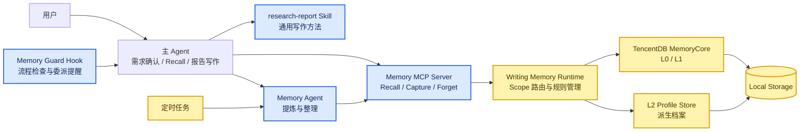

# research-report-memory v1 功能设计

> 文档状态：v1.0.0 MVP 实现基线
>
> 日期：2026-08-13
> 范围：报告写作专用 Memory，不扩展为通用个人记忆系统

### v1.0.0 实现状态

已启用：独立 v1 插件/MCP/数据目录、WorkBuddy Memory Agent、L0 Writing Episode、六维 L1、四种 Scope、capture 内的 store/update/merge/skip、同维度优先级消解、L2 Profile/dirty、14 天 pending 清理、手动与 macOS 每日维护入口。

后续项：Codex/Claude Code 安装级 E2E、定时任务逾期补跑与失败重试状态、Scope 值归一化、Episode 长期保留策略、跨任务真实效果评测。

## 1. 升级目标

在不改动 v0.2.2 的前提下，新建并行 v1，将只有 L1 规则读写的旧版升级为一套分层写作记忆系统：

- 主 Agent 专注需求理解、Memory Recall 和报告写作；
- 独立 Memory Agent 负责 L0 记录、L1 提炼、冲突处理、错误复查和 L2 整理；
- L0 保存带任务语境的 Writing Episode，作为可重新解释的来源证据；
- L1 保存已经确认可复用的原子写作规则；
- L2 按 `Scope × Writing Dimension` 形成用户写作偏好档案；
- 前台只做必要的 Recall 和 Memory Agent 委派，复杂整理不进入写作上下文；
- Memory 只处理报告写作相关信息，不保存生活偏好、身份事实或其他通用信息。

## 2. 核心设计结论

1. **职责隔离**：写作与 Memory 提炼使用不同 Agent 上下文。主 Agent 不在报告写作上下文中承担复杂记忆判断。
2. **Memory Agent**：使用独立 Instruction，处理 Writing Episode、L0→L1 晋升、错误提炼复查、L1 冲突和 L2 聚合。
3. **两个分类轴**：只保留 `Scope × Writing Dimension`，不增加 Memory Kind。
4. **四种 Scope**：`default`、`audience`、`report_type`、`situation`。
5. **六个稳定维度**：`traceability`、`structure`、`narrative`、`insight`、`coverage`、`expression`。维度不跟随 Judge checks 的细节变化。
6. **L2 聚合键**：`scope + scopeValue + dimension`。
7. **召回优先级**：当前用户要求 > situation > audience > report_type > default > research-report skill。
8. **冲突更新**：同一聚合范围内复用 MemoryCore 的 `store / skip / update / merge` 语义；明确纠正时以新信息为准。
9. **L2 形态**：保留 `summary + rules + sourceL1Ids`，兼顾压缩、可执行性与可追溯性。
10. **控制上下文体积**：存储可以有最小结构，Recall 只返回写作所需的规则正文，不向主 Agent 注入数据库字段。
11. **简单拼接**：MVP 不生成复杂 Writing Spec，直接将用户任务、research-report Skill 和精简 Memory Context 共同交给主 Agent。
12. **功能后移**：Edit Learning、Exemplar Retrieval 和 Writing Spec Compiler 不进入本期 MVP。

## 3. 整体功能架构



### 3.1 组件职责

| 组件 | 功能职责 | 不负责 |
|---|---|---|
| 主 Agent | 确认需求、调用 Recall、加载 Skill、完成报告、委派 Memory Agent | 复杂偏好提炼和历史整理 |
| research-report Skill | 定义通用报告分析和写作方法 | 保存用户 Memory |
| Memory Agent | 记录 L0、提炼 L1、检查冲突、复查错误、整理 L2 | 写报告、修改 Skill |
| Memory Guard Hook | 确保写作前 Recall；反馈后检查是否完成 Memory 委派与写入 | 直接生成或修改 Memory |
| Memory MCP Server | 提供 Recall、Capture、Forget 三个 Agent 业务入口 | 发起 Subagent |
| Writing Memory Runtime | 写作相关性校验、Scope 路由、召回组合和状态管理 | 报告写作 |
| MemoryCore | L0/L1 存储、查询、更新、合并和删除 | 决定报告内容 |
| L2 Profile Store | 保存 Runtime/Memory Agent 生成的派生档案与 dirty 状态 | 自动产生新偏好 |
| 定时任务 | 独立唤醒 Memory Agent 进行批量维护 | 占用当前报告会话 |

### 3.2 Memory Agent 的发起边界

MCP Server 是被 Agent 调用的工具服务，不能主动要求宿主创建 Subagent。Memory Agent 只能由以下入口发起：

1. 主 Agent 在反馈处理完成后主动委派；
2. Hook 提醒或阻止主 Agent 遗漏委派；
3. 定时任务启动一个独立 Memory Agent/CLI 会话；
4. 宿主不支持 Subagent 时，使用独立 CLI Agent 会话执行同一份 Instruction。

v1.0.0 已按 WorkBuddy 插件的 `agents/` 约定打包自定义 Agent，并提供独立 CLI 定时入口；Codex、Claude Code 的安装与运行级 E2E 验证仍属于后续兼容性工作。

## 4. Memory Agent

### 4.1 单一职责

Memory Agent 使用与 research-report Skill 分离的 Instruction，只处理报告写作记忆：

```text
你是 research-report Memory Curator。

你只处理报告写作相关记忆，不写报告、不修改报告、不修改 Skill。

你的职责：
1. 保存带上下文的 Writing Episode / L0；
2. 判断反馈是当前操作、临时要求还是长期偏好；
3. 明确长期偏好可以形成 L1；
4. 不确定要求保持为 pending L0；
5. 结合多个任务重新审视 pending L0；
6. 对新旧记忆执行 store / skip / update / merge；
7. 重新审视并修正历史错误提炼；
8. 按 Scope × Writing Dimension 整理 L2；
9. 不从单次编辑过度推断用户偏好；
10. 所有 L1 必须能够追溯到 L0/Episode。
```

### 4.2 两种运行模式

| 模式 | 触发 | 工作内容 |
|---|---|---|
| 前台委派 | 用户给出反馈、主 Agent 完成当前修改后 | 保存本次 Episode/L0；明确长期偏好时形成 L1 |
| 后台维护 | 定时任务或逾期补跑 | 审查 pending L0、复查 L1、处理冲突、更新 L2 |

前台委派会增加少量等待时间，但不把 Memory 推理过程写入主 Agent 的报告上下文。后台维护完全独立于当前报告任务。

## 5. 分层记忆模型

### 5.1 L0：Writing Episode

L0 不只保存一条反馈，而是保存能够重新理解写作决策的任务级 Episode。MVP 保存关键节点，不保存每一个无价值中间状态。

每个 Episode 包含：

- 已确认的任务要求；
- topic、audience、report_type、situation 和写作阶段；
- 本次实际召回的 Memory 引用；
- 用户正在评价的报告版本或相关内容；
- 用户反馈原文；
- 主 Agent 的修改结果或最终交付版本；
- 来源 session、task 和时间；
- 候选状态：pending、promoted、dismissed。

如当前宿主能够可靠观察修改前后版本，可以附带关键 edit pair；MVP 只保存，不做自动 Edit Learning。

L0 的价值包括：

- 保留单次反馈的真实语境；
- 发现跨任务重复出现的隐性偏好；
- 为 L1 提炼、错误纠正和 Forget 提供来源；
- 允许未来使用更强模型重新理解旧反馈；
- 避免将“这份报告控制在三页”过早固化为长期规则。

### 5.2 L1：可复用原子写作规则

L1 只保存已经确认具有复用价值的写作要求。一条 L1 只表达一条规则，只属于一个 Scope 和一个 Writing Dimension。

L1 来源有两类：

1. 用户明确使用“以后、默认、一直、都要”等长期表达，由前台 Memory Agent 提炼；
2. 多个 L0 在不同任务中形成稳定模式，由后台 Memory Agent 综合判断后晋升。

晋升不采用固定的出现次数阈值，由模型综合判断：

- 是否存在明确长期措辞；
- 是否跨不同任务重复；
- 是否属于用户反复纠正的同类问题；
- 是否稳定集中在某个 audience、report_type 或 situation；
- 多次表达是否语义一致；
- 同一 session 内重复不视为多个独立证据。

### 5.3 L2：分 Scope、分维度的偏好档案

L2 是 L1 的派生视图，不是新的事实来源。

```text
聚合键 = scope + scopeValue + dimension
```

示例：

```text
default:* / narrative
audience:管理委员会 / expression
report_type:复盘报告 / structure
situation:project-123 / traceability
```

每个 L2 Block 保存：

- `summary`：该范围和维度的简短总结；
- `rules`：当前有效规则；
- `sourceL1Ids`：来源 L1；
- 版本、更新时间和 active/dirty 状态。

L1 新增、更新、合并或删除后，对应 L2 进入 dirty 状态，由后台 Memory Agent 重建。

## 6. 两个分类轴

### 6.1 Scope

| Scope | 含义 | 示例 |
|---|---|---|
| `default` | 默认场景的个人长期写作偏好 | 默认精炼、结论先行 |
| `audience` | 针对特定受众的写作要求和与写作有关的关注重点 | 给 M 的相关报告覆盖 ROI；给业务团队增加执行细节 |
| `report_type` | 针对特定报告类型的要求 | 复盘报告写清问题、原因和动作 |
| `situation` | 针对特定项目、主题或阶段的临时写作约束 | 当前方案未确认，避免使用“已确定” |

`scopeValue` 的取值：

```text
default      → 无
audience     → 管理委员会 / 业务团队 / 外部客户
report_type  → 战略分析报告 / 复盘报告
situation    → 项目 ID、主题 ID 或任务场景标识
```

Writing doctrine 仍由 research-report Skill 提供，不作为用户 Memory 重复存储；Personal preference 进入 `default`。最终写作时，Skill 与 default Memory 一起提供给主 Agent。

Situation 只保存会影响报告写作的当前约束，不扩展为通用项目事实库。

首期不增加 `audience + report_type` 组合 Scope，避免产生大量稀疏档案。

### 6.2 Writing Dimension

| Dimension | 中文 | 记忆覆盖内容 |
|---|---|---|
| `traceability` | 可回溯性与支撑充分 | 数据、信源、口径、证据边界 |
| `structure` | 结构 | 摘要、章节、信息摆放、篇幅结构 |
| `narrative` | 逻辑与故事线 | 论证顺序、主线、因果和递进 |
| `insight` | 提炼与洞察 | 归因、规律、趋势、建议的提炼方式 |
| `coverage` | 覆盖度 | 必答问题、重点内容和完整性要求 |
| `expression` | 表达与受众契合 | 语气、措辞、详略、标题、图表与呈现 |

复合反馈由 Memory Agent 拆为多条原子 L1，不在一条 L1 上设置多个维度。

## 7. 最小数据与上下文控制

### 7.1 L1 最小语义结构

L1 只保留提炼和追溯所必需的字段：

```json
{
  "rule": "在 CW 海外相关汇报中覆盖 ROI 和数据经济性",
  "scope": "audience",
  "scopeValue": "M",
  "dimension": "coverage",
  "sourceIds": ["episode_184"]
}
```

`expiresAt` 仅用于具有时效性的 audience 或 situation 规则。ID、创建时间、状态等由存储系统内部维护，不作为 Memory 正文。

MVP 不强制增加 `strength`、`confidence`、`prefer`、`avoid`、`exceptions`、`explicit/inferred`、`counterexamples` 等字段。复杂判断保留在 Episode 来源中，需要时由 Memory Agent 重新审视。

### 7.2 Recall 输出

存储结构不等于注入结构。Recall 不向主 Agent 返回完整记录字段，而是按优先级输出精简规则正文：

```text
<writing-memory>
【当前场景】
- 当前方案仍在讨论阶段，避免写成已经确认或已经落地。

【受众：M】
- 在 CW 海外相关汇报中覆盖 ROI 和数据经济性。

【报告类型：战略分析报告】
- 先陈述核心判断，再展开依据和建议。

【默认偏好】
- 正文保持精炼，减少过程性语言。
</writing-memory>
```

六维标签主要用于内部聚合和检索，不必全部暴露给主 Agent。核心原则是：**存储可以结构化，召回必须内容化。**

## 8. 核心功能路径

### 8.1 开始报告：Skill + Memory 简单拼接

```text
用户完成需求确认
→ 主 Agent 识别 situation、audience 和 report_type
→ 调用 writing_memory_recall
→ Runtime 检索 situation / audience / report_type / default
→ 按优先级消解冲突
→ 返回精简 Memory Context
→ 主 Agent 同时使用当前任务 + research-report Skill + Memory Context
→ 开始报告写作
```

MVP 不生成独立 Writing Spec，不启动 Context Compiler、Planner 或 Critic。

覆盖优先级：

```text
当前用户要求 > situation > audience > report_type > default > research-report skill
```

同一层级内部，以最新有效规则为准。Recall 不同时返回互相矛盾的规则。

### 8.2 用户反馈：主 Agent 委派 Memory Agent

```text
用户提出写作反馈或修改要求
→ 主 Agent 完成当前报告修改
→ 主 Agent 将本轮必要上下文委派给 Memory Agent
→ Memory Agent 保存 Writing Episode / L0
→ 判断是否是明确长期偏好
   ├─ 是：提炼并写入 L1
   └─ 否：保留为 pending L0
→ Memory Agent 返回简短状态
→ 主 Agent 完成交付
```

非写作内容不进入 L0。带明确报告语境的单次写作要求可以进入 Writing Episode，但“修改吧、删掉”等裸操作授权不会进入。

### 8.3 定时维护：L0→L1→L2

```text
定时任务启动独立 Memory Agent
→ 扫描 pending L0、可疑 L1 和 dirty L2
→ 按相似主题、任务和 Scope 组织候选
→ 综合多个 Episode 判断是否晋升 L1
→ 复查错误或过时提炼
→ 对 L1 执行 store / skip / update / merge
→ 重建受影响的 scope × dimension L2
→ 保存结果和来源关系
```

维护失败时不应影响前台 Recall 和报告写作。v1 保留日志并等待下个定时周期；事务级完整回滚与自动重试状态仍需增强。

### 8.4 更新、合并与删除

同一 `scope + scopeValue + dimension` 内的新旧规则使用以下语义：

| 动作 | 功能含义 |
|---|---|
| `store` | 新规则与已有规则主题不同，新增 |
| `skip` | 已有规则已完整表达，新内容无增量 |
| `update` | 新内容更晚、更明确，或纠正旧规则 |
| `merge` | 新旧规则互补，合并为更完整规则 |

用户要求忘记某项偏好时：

```text
定位 L1
→ 删除或更新对应规则
→ 将相关 L2 标记 dirty
→ 后续 Recall 不再返回旧规则
→ 后台 Memory Agent 重建 L2
```

如果用户要求彻底删除，同时清除关联 Episode 原文；普通 Forget 是否保留来源证据仍需最终确认。

## 9. 定时整理模式

### 9.1 功能要求

- 定时整理不依赖用户正在执行报告任务；
- 使用独立 Memory Agent 上下文，不占用写作 Agent 上下文；
- 同一批维护任务串行执行，避免同时改写相同 L1/L2；
- 记录最后执行时间、处理数量、失败原因和重试状态；
- 用户再次选择 Skill 或启动 MCP 时，如果计划任务逾期，触发补偿执行。

### 9.2 触发路径

当前 MCP 属于宿主按需启动模式，进程退出后内部计时器无法继续运行。v1 采用外部定时任务作为主路径：

```text
已实现：独立定时任务启动 Memory Agent
后续增强：Skill/MCP 下次激活时检查 due 状态并补跑
```

TencentDB MemoryCore 的后台 Pipeline 可以作为调度语义参考，但产品不能假设 MemoryCore 进程始终在线。

首期建议每日整理一次；是否需要更高频率，待真实反馈积累速度验证。

## 10. Writing Episode 生命周期与隐私

### 10.1 两级保留策略

不再对所有 L0 使用统一的 14 天删除规则：

| 数据 | 默认保留策略 |
|---|---|
| 普通对话和临时候选上下文 | 14 天 |
| `pending` 且没有复用证据的 Episode | 14 天后删除或压缩 |
| `dismissed` Episode | 14 天后删除 |
| 已产生有效 L1 的关键 Episode | 长期保留关键任务信息、反馈、结果和来源关系 |
| 可观察到的关键 edit pair | 随关键 Episode 保留，仅作为未来数据基础 |
| 用户要求彻底删除 | 立即删除，不等待到期 |

长期 Episode 只保存任务关键节点，不保存所有模型中间稿。这样既保留重新提炼和纠错能力，又控制本地数据规模与隐私风险。

### 10.2 待确认点

- 关键 Episode 是长期保留，还是设置 90/180 天默认期限；
- 长期 Episode 保留完整报告版本，还是只保留文件引用和关键反馈片段；
- 普通 Forget 是否默认同步删除关联 Episode；
- 是否向用户提供保留期和“清除全部 Writing History”配置。

## 11. 本地数据视图

```text
Local Memory
├── L0 Writing Episodes
│   └── 任务关键节点、反馈、结果、候选状态和来源
├── L1 Writing Rules
│   └── rule、Scope、Dimension 和 sourceIds
├── L2 Writing Profiles
│   └── summary、rules、sourceL1Ids 和版本状态
└── Maintenance State
    └── 调度时间、cursor、dirty keys 和失败重试状态
```

MemoryCore SQLite 是 L0/L1 的查询与当前有效状态来源；L1 JSONL 用于可读审计；v1 的 L2 当前保存在 `profiles/*.json`，由 Runtime 管理 active/dirty 状态。

## 12. 功能边界

本期 MVP 明确不包括：

- 通用用户 Persona 或生活偏好；
- 与写作无关的项目事实、工作经历和人物档案；
- L3 用户画像；
- 自动修改 research-report Skill；
- 独立 Memory Kind 分类轴；
- 根据 OpenHarness 单条 Judge check 建立动态分类；
- audience 与 report_type 的组合 Scope；
- 自动 Edit Attribution / Edit Learning；
- Exemplar Bank 检索和 Few-shot 注入；
- Writing Spec Compiler、Pyramid Planner、Personalized Critic；
- Fine-tune、Preference Scorer、Edit Predictor；
- 云端同步和多人共享 Memory。

Writing Episode 可以为未来 Edit Learning 和 Exemplar Retrieval 保留数据基础，但这些能力不进入本期开发和验收范围。

## 13. v1 后续讨论事项

1. WorkBuddy 先采用 `situation > audience > report_type > default`；真实任务中是否需要调整；
2. Codex、Claude Code 的安装与自定义 Memory Agent 继承 MCP 工具方式；
3. 主 Agent 委派失败时，继续硬阻断还是记录待补任务后放行；
4. 关键 Writing Episode 的长期保留周期和内容范围；
5. 每日一次整理是否满足真实反馈积累速度；
6. audience、report_type 和 situation 的标准值如何归一化；
7. 普通 Forget 是否默认同步删除关联 Episode。

## 14. 版本演进

| 阶段 | 功能结果 |
|---|---|
| v1.0.0 | Memory Agent、Writing Episode、四种 Scope、六维 L1、update/merge、L2 Profile、精简 Recall 和每日维护入口 |
| v1.1 | 逾期补跑、维护失败重试/游标、Scope 归一化、安装兼容性增强 |
| v1.2 | Episode 生命周期配置、Memory 质量评测、冲突与晋升效果迭代 |
| Future | Edit Learning、Exemplar Retrieval、Writing Spec Compiler 等增强能力 |
