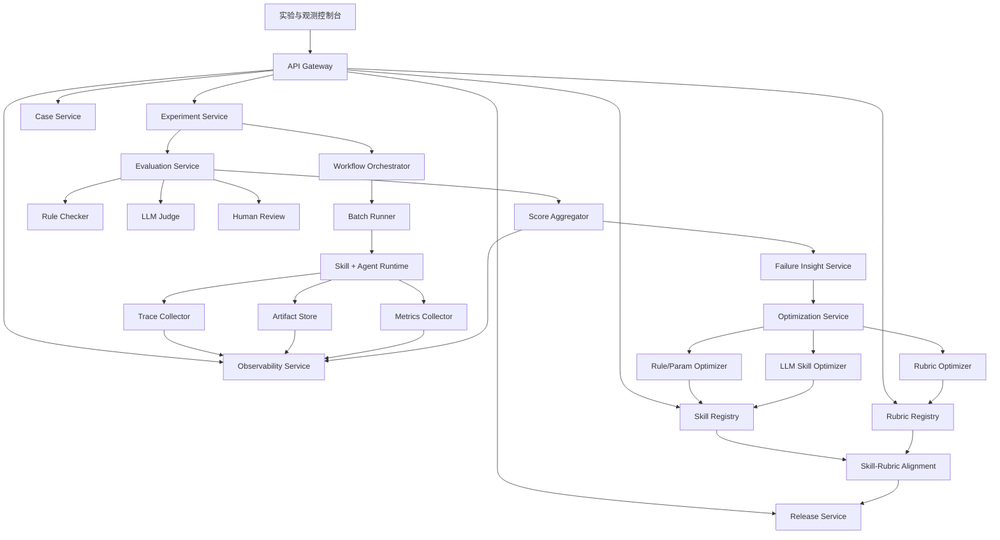
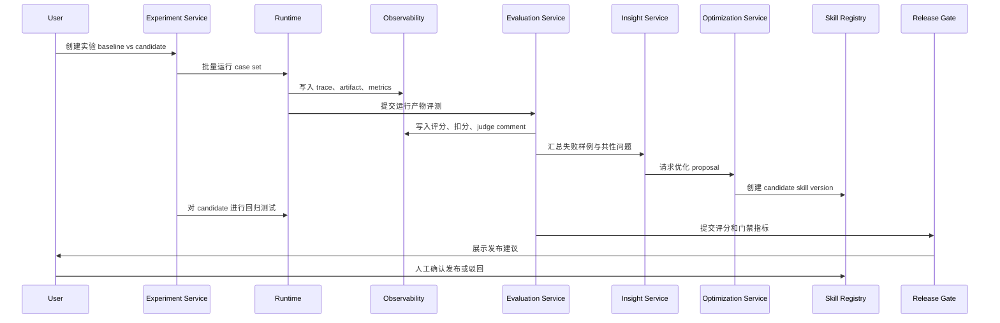
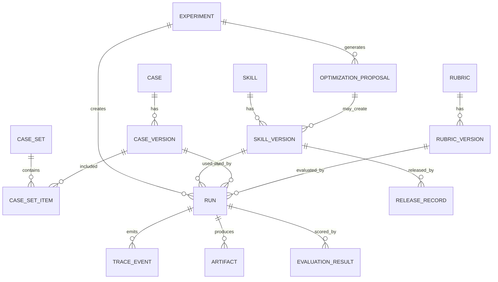
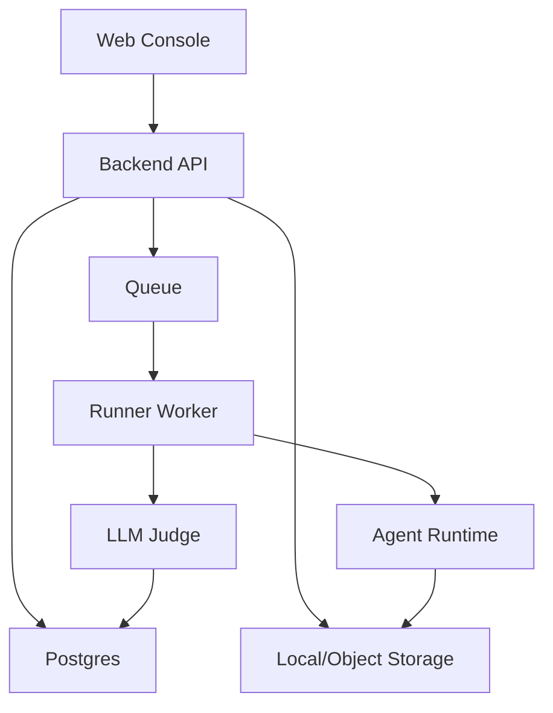

# Skill 自优化平台系统设计文档

## 1. 背景与目标

### 1.1 背景

当前已有的 skill 形态通常由 `SKILL.md`、prompts、references、schemas、scripts 和 templates 等文件组成。它可以把一类任务的方法论、执行流程、质量规则和工具能力封装起来，让 Agent 在特定场景下稳定工作。

但当 skill 进入真实业务使用后，会持续遇到几个问题：

- 不知道每一版 skill 在不同用例上的真实表现。
- 不知道一次输出变好或变差到底是因为 prompt、workflow、rubrics、模型配置，还是 case 本身变化。
- 用户反馈难以系统沉淀，容易停留在人工改 prompt。
- 评测结果缺乏证据链，无法定位问题发生在执行链路的哪一步。
- 优化缺少发布门禁，可能让新版本在少数样例上变好、但在关键 P0 用例上退化。

因此需要建设一个 Skill 自优化平台，让 `Skill 版本`、`Rubrics 版本`、`Case 用例`、`执行链路`、`运行产物`、`评分结果` 和 `优化建议` 形成一个可观测、可回归、可发布、可回滚的闭环系统。

### 1.2 平台定位

Skill 自优化平台是面向 Agent Skill 的实验、评测、观测和自动改进平台。

它不是普通日志系统，也不是单次 prompt 评测工具，而是一个持续迭代系统：

```text
用例管理
-> Skill 版本运行
-> 执行链路与产物留档
-> Rubrics 自动/人工评测
-> 评分归因与共性问题分析
-> 优化 proposal 生成
-> Candidate Skill 回归测试
-> 发布、回滚与 Rubrics 对齐
```

### 1.3 设计目标

- 支持每一版 skill 在每个用例上的评分追踪。
- 支持查看每个 case run 的完整执行链路、工具调用、中间产物和最终结果。
- 支持 baseline 与 candidate skill 的版本对比。
- 支持 LLM judge 和 human judge 协同评测。
- 支持基于失败样例、共性问题和评分结果生成优化建议。
- 支持 skill、rubric、case、model config、run config 的版本化与不可变留档。
- 支持发布门禁，避免关键用例退化。
- 支持从单个 skill 扩展到多 skill、多业务线、多团队协作。

### 1.4 非目标

第一阶段不追求完全无人值守自动发布。LLM 可以生成优化 proposal，但是否发布新版 skill 应经过门禁和人工确认。

第一阶段不做通用 MLOps 平台，也不替代模型训练、模型评测或底层 Agent runtime。平台重点管理 skill 层面的工作流、规则、产物、评分和优化。

---

## 2. 核心概念

### 2.1 Skill

Skill 是 Agent 完成某类任务的可复用能力包，包括：

- 触发条件和适用场景
- 主流程和执行步骤
- prompt 和角色提示词
- references 和方法论
- schemas 和输出结构
- scripts 和确定性工具
- templates 和样例
- 质量规则和交付标准

平台中所有 skill 都必须版本化。每次变更生成新的 `skill_version`，不得覆盖历史版本。

### 2.2 Rubrics

Rubrics 是评测 skill 输出质量的标准集合，包括：

- 评分维度
- 权重
- 分档标准
- critical fail 规则
- judge prompt
- 好坏样例
- 人工复核要求
- 达标阈值

Rubrics 同样必须版本化。否则无法判断分数变化是来自 skill 变化，还是评测标准变化。

### 2.3 Case

Case 是可重复运行的测试用例。一个 case 包含用户问题、输入材料、期望行为、优先级、标签和 golden notes。

建议分级：

| 优先级 | 含义 | 用途 |
| --- | --- | --- |
| P0 | 线上关键失败、核心业务场景、高价值样例 | 发布门禁，不能退化 |
| P1 | 常见稳定场景 | 主回归集 |
| P2 | 边界场景、探索场景、低频场景 | 泛化能力观察 |

### 2.4 Run

Run 是一次具体执行。它由以下输入唯一确定：

```text
skill_version
rubric_version
case_version
model_config
tool_config
run_config
runtime_version
```

Run 的输出包括 trace、artifacts、metrics、logs 和 evaluation results。

### 2.5 Trace

Trace 是执行链路的结构化记录。它不是纯文本日志，而是可查询、可聚合、可下钻的事件序列。

### 2.6 Artifact

Artifact 是执行过程或最终交付生成的产物，例如：

- 最终报告
- 链路图
- 数据出处
- 中间摘要
- source map
- 图表
- 表格
- QA 报告
- 错误截图

### 2.7 Evaluation

Evaluation 是对某个 run 的评测结果。可以由 LLM judge、human judge、规则校验器或混合评测器生成。

### 2.8 Optimization Proposal

Optimization Proposal 是基于评分结果和失败归因生成的改进方案，可能包含：

- skill 修改建议
- prompt 修改建议
- workflow 修改建议
- few-shot 替换建议
- rubric 调整建议
- case 补充建议
- 风险和回归范围

---

## 3. 总体架构

### 3.1 架构总览



### 3.2 分层说明

| 层级 | 责任 | 核心组件 |
| --- | --- | --- |
| 产品层 | 管理实验、观察结果、审批发布 | 控制台、评分看板、trace viewer、diff viewer |
| 应用服务层 | 管理平台核心对象 | Skill、Rubric、Case、Experiment、Evaluation、Release |
| 编排层 | 批量运行、重试、队列、调度 | Orchestrator、Batch Runner、Scheduler |
| Runtime 层 | 真正执行 skill | Agent Runtime、Tool Adapter、Model Adapter |
| 评测层 | 规则检查、LLM 打分、人工复核 | Rule Checker、LLM Judge、Human Review |
| 优化层 | 归因、生成修改建议、创建候选版本 | Optimizer、Failure Analyzer、Alignment Checker |
| 数据层 | 元数据、产物、trace、事件、向量检索 | Postgres、Object Storage、Vector DB、Event Log |
| 治理层 | 权限、审计、发布门禁、回滚 | IAM、Audit、Policy、Release Gate |

---

## 4. 核心业务流程

### 4.1 标准自优化闭环



### 4.2 分数未达标流程

1. 选择当前 production skill version 作为 baseline。
2. 选择目标 case set，例如 `briefing-doc-generator/p0+p1-regression`。
3. 批量运行。
4. 使用当前 rubric version 自动评分。
5. 若总分、P0 通过率或 critical fail 未达标，进入失败归因。
6. 聚合低分 case，识别高频扣分维度和共性问题。
7. 生成优化 proposal。
8. 创建 candidate skill version。
9. 对 candidate 重跑同一批 case。
10. 与 baseline 对比，判断是否继续迭代。

### 4.3 分数达标流程

分数达标后不应直接停止，而要进入 rubrics 对齐：

1. 检查高分样例是否真的符合业务预期。
2. 抽样 human review 校准 LLM judge。
3. 检查 rubric 是否遗漏新风险，例如引用缺失、过度压缩、成本升高、结构变复杂。
4. 若发现 rubric 过松，生成 rubric update proposal。
5. 新 rubric 版本需要反向回测历史高分样例。
6. Skill 与 Rubric 对齐后，才可发布。

### 4.4 观测下钻流程

用户在看板看到某个 case 从 84 分降到 76 分后，可以按以下路径排查：

```text
Skill Version Dashboard
-> Case Score Matrix
-> 单击退化 case
-> Case Run Detail
-> Trace Timeline
-> 查看失败 step 的输入、输出、工具调用、耗时、错误
-> 打开最终 artifact
-> 查看 judge 扣分理由
-> 对比 baseline run 的同一 step
-> 标注人工原因
-> 加入优化 proposal
```

---

## 5. 功能模块设计

### 5.1 Experiment Service

Experiment Service 负责定义和执行实验。

核心能力：

- 创建实验。
- 选择 skill version、rubric version 和 case set。
- 配置模型、工具、并发、重试、随机种子。
- 启动批量 run。
- 管理实验状态。
- 聚合实验结果。
- 生成 baseline vs candidate 对比。

实验类型：

| 类型 | 说明 |
| --- | --- |
| Regression | 回归测试，验证新版是否退化 |
| A/B Test | 对比两个或多个 skill 版本 |
| Ablation | 关闭某些 directive 或 workflow step，观察影响 |
| Grid Search | 枚举规则组合、few-shot 组合或参数组合 |
| Judge Calibration | 对比 LLM judge 与 human judge |
| Rubric Backtest | 新 rubric 回测历史 run |

### 5.2 Skill Registry

Skill Registry 是 skill 资产和版本中心。

核心能力：

- 创建 skill。
- 导入本地 skill 目录。
- 解析 `SKILL.md`、prompts、references、schemas、scripts。
- 创建新 skill version。
- 展示版本 diff。
- 标记 production、staging、archived。
- 回滚到历史版本。
- 记录变更原因和关联 proposal。

建议的版本内容：

```text
SkillVersion
- skill_version_id
- skill_id
- version
- status
- parent_version_id
- source_snapshot_uri
- manifest
- entrypoint
- workflow_steps
- directives
- prompt_refs
- reference_refs
- schema_refs
- script_refs
- template_refs
- changelog
- created_by
- created_at
```

对当前项目中的 `briefing-doc-generator`，平台可以把这些资产纳入 registry：

```text
skills/briefing-doc-generator/SKILL.md
skills/briefing-doc-generator/prompts/*
skills/briefing-doc-generator/references/*
skills/briefing-doc-generator/schemas/*
skills/briefing-doc-generator/scripts/*
skills/briefing-doc-generator/assets/templates/*
```

### 5.3 Rubric Registry

Rubric Registry 管理所有评分标准。

核心能力：

- 创建 rubric。
- 编辑评分维度、权重、分档描述。
- 绑定适用 skill。
- 管理 LLM judge prompt。
- 管理 human review checklist。
- 维护好坏样例。
- 版本 diff。
- rubric backtest。

推荐维度：

| 维度 | 说明 |
| --- | --- |
| 任务完成度 | 是否完整解决用户问题 |
| 链路完整性 | 是否完成必要步骤，是否有断链 |
| 证据可追溯 | 重要结论是否有来源 |
| 数据准确性 | 数字、引用、图表是否正确 |
| 结论 solid 程度 | 判断是否有支撑，是否过度发挥 |
| 结构 | 是否结论先行、层次清晰 |
| 逻辑与故事线 | 是否形成连贯论证 |
| 提炼与洞察 | 是否从事实上升为有价值判断 |
| 覆盖度 | 是否遗漏关键输入 |
| 表达 | 是否简洁、专业、适合目标读者 |
| 成本与延迟 | 是否在可接受资源范围内 |

critical fail 示例：

- 编造关键事实。
- P0 用例没有生成最终报告。
- 输出不符合必须 schema。
- 引用来源与原文不匹配。
- 泄露不应展示的内部推理或敏感信息。

### 5.4 Case Service

Case Service 管理测试用例。

核心能力：

- 创建、编辑和版本化 case。
- 组织 case set。
- 标注优先级、标签、业务场景和难度。
- 维护 golden notes。
- 记录来源材料。
- 支持从线上失败 run 一键转成 case。
- 支持相似 case 检索。

Case 数据结构：

```text
CaseVersion
- case_version_id
- case_id
- version
- priority: P0 | P1 | P2
- title
- topic
- user_inputs
- raw_material_refs
- expected_behavior
- golden_notes
- tags
- difficulty
- owner
- source: manual | production_failure | synthetic | imported
- created_at
```

Case Set 数据结构：

```text
CaseSet
- case_set_id
- name
- description
- case_version_ids
- policy
- created_by
- created_at
```

### 5.5 Workflow Orchestrator 与 Batch Runner

Orchestrator 负责任务调度，Batch Runner 负责并发执行。

核心能力：

- 生成 run plan。
- 拆分 case 任务。
- 控制并发。
- 失败重试。
- 超时中断。
- 幂等执行。
- 记录 runtime 版本。
- 支持 replay。

Run 状态：

```text
queued
running
succeeded
failed
cancelled
evaluating
evaluated
```

Run 输入必须冻结：

```text
RunInput
- skill_version_id
- rubric_version_id
- case_version_id
- model_config_id
- tool_config_id
- run_config_id
- random_seed
- runtime_version
```

### 5.6 Skill + Agent Runtime

Runtime 是真正执行 skill 的地方。平台不需要绑定某一种 Agent 框架，但需要定义统一适配协议。

Runtime Adapter 需要实现：

```text
prepare(run_input)
execute(case_input)
emit_trace(event)
emit_artifact(artifact)
emit_metric(metric)
finalize()
```

对不同平台可以提供不同 adapter：

- Codex Skill Adapter
- LangGraph Adapter
- AutoGen Adapter
- CrewAI Adapter
- Dify / Coze Adapter
- 自研 Agent Adapter

Runtime 输出：

```text
RunOutput
- final_answer
- artifacts
- trace_id
- token_usage
- latency_ms
- tool_calls
- errors
- runtime_metadata
```

### 5.7 Evaluation Service

Evaluation Service 负责把 run output 转成可比较的评分。

评测分三层：

1. 规则校验
   - schema 是否有效。
   - 必需 artifact 是否存在。
   - 来源 ID 是否可解析。
   - 链路 step 是否完整。

2. LLM judge
   - 根据 rubric 逐维度打分。
   - 输出扣分理由。
   - 抽取共性问题。
   - 给出置信度。

3. Human review
   - 抽检 P0。
   - 复核低置信度 judge。
   - 复核 candidate 发布前关键样例。

EvaluationResult：

```text
EvaluationResult
- evaluation_id
- run_id
- rubric_version_id
- evaluator_type: rule | llm | human | aggregate
- total_score
- dimension_scores
- deductions
- critical_failures
- pass_status
- judge_comment
- common_issues
- confidence
- created_at
```

Score Aggregator 聚合规则：

```text
final_score =
  weighted_dimension_score
  - critical_fail_penalty
  - schema_violation_penalty
```

若出现 critical fail，则即使总分较高，也应判定为不可发布。

### 5.8 Observability Service

Observability Service 是平台的观测中心，也是本系统区别于普通评测工具的关键模块。

它回答三类问题：

1. 每一版 skill 整体表现如何？
2. 每个用例在每一版 skill 下得分如何？
3. 每个用例执行时到底发生了什么，最终生成了什么？

#### 5.8.1 Skill Version Dashboard

看板指标：

- 总分均值、中位数、P90/P10。
- P0/P1/P2 通过率。
- critical fail 数量。
- 各评分维度均值。
- 相对上一版提升/下降。
- 成本、延迟、token 用量。
- 失败用例 Top N。
- 共性问题聚类。
- 发布门禁状态。

评分矩阵：

| Case | Priority | v10 | v11 | v12 | Trend | Issue |
| --- | --- | --- | --- | --- | --- | --- |
| case_001 | P0 | 78 | 85 | 92 | 上升 | 已修复来源缺失 |
| case_002 | P0 | 91 | 90 | 90 | 持平 | 无 |
| case_031 | P1 | 88 | 84 | 76 | 下降 | 关键引用被压缩 |

#### 5.8.2 Case Run Detail

单用例详情页布局：

```text
左侧：Case 信息
- 用户输入
- 原始素材
- 期望行为
- golden notes
- tags

中间：Trace Timeline
- plan
- extract
- transform
- tool_call
- generate
- validate
- final

右侧：评分与扣分
- 总分
- 维度分
- critical fail
- judge comment
- human note
```

支持操作：

- 查看 step 输入和输出。
- 查看工具调用参数和返回值。
- 打开最终报告、图表和数据出处。
- 对比 baseline run 的同一 step。
- 标注失败原因。
- 将 run 转成回归 case。
- 将问题加入 optimization proposal。

#### 5.8.3 Trace 数据模型

```text
TraceEvent
- trace_event_id
- trace_id
- run_id
- case_version_id
- skill_version_id
- sequence_no
- parent_event_id
- step_name
- step_type: plan | prompt | tool_call | transform | generate | validate | final
- input_ref
- output_ref
- status: started | succeeded | failed | skipped
- latency_ms
- token_input
- token_output
- model_name
- tool_name
- error_code
- error_message
- created_at
```

大字段不直接塞数据库，使用 `input_ref` 和 `output_ref` 指向 Object Storage，数据库只保留索引和预览。

#### 5.8.4 Artifact 数据模型

```text
Artifact
- artifact_id
- run_id
- case_version_id
- skill_version_id
- type: report | chart | table | source_map | qa_report | chain | log | file
- title
- content_hash
- storage_uri
- preview_text
- mime_type
- metadata
- created_at
```

Artifact 应支持版本冻结、预览、下载、全文检索和相似检索。

#### 5.8.5 版本 Diff

版本对比页需要同时展示四类 diff：

- Skill source diff：prompt、workflow、reference、schema 的变化。
- Score diff：case 级别和维度级别得分变化。
- Trace diff：关键步骤是否变化，是否新增/缺失步骤。
- Artifact diff：最终报告结构、引用、图表、数据出处变化。

### 5.9 Failure Insight Service

该服务把单次评分结果转成可行动的问题归因。

输入：

- run outputs
- trace events
- artifacts
- evaluation results
- human notes
- baseline comparison

输出：

- common issue clusters
- failed dimensions
- representative cases
- suspected root cause
- affected skill components
- suggested regression scope

问题分类建议：

| 分类 | 示例 |
| --- | --- |
| 输入理解失败 | 没抓住用户真正目标 |
| 数据处理失败 | 清洗漏掉关键段落 |
| 结构规划失败 | 没有形成 3-5 条主线 |
| 证据支撑失败 | 判断没有来源 |
| 表达失败 | 太散、太空、像流水账 |
| 工具失败 | 脚本报错、文件解析失败 |
| 规则冲突 | 压缩规则和引用完整性冲突 |
| 成本问题 | 输出过长、重复调用模型 |

### 5.10 Optimization Service

Optimization Service 生成可审查的优化方案，而不是直接静默改 skill。

优化类型：

#### 规则/参数优化

适合确定性搜索：

- directive 开关组合。
- few-shot 组合。
- workflow step 顺序。
- 输出 schema 约束强度。
- retry 和 validation 策略。
- 模型参数。

#### LLM Skill 优化

输入：

```text
当前 skill version
当前 rubric version
失败 case 列表
run artifacts
trace 摘要
评分结果
共性问题
human notes
baseline diff
```

输出：

```text
OptimizationProposal
- 修改目标
- 涉及文件
- 修改 diff
- 修改原因
- 预期提升维度
- 可能风险
- 必跑回归 case
- 是否建议人工审核
```

#### Rubric 优化

当高分输出仍不符合真实业务品味，或人工 judge 与 LLM judge 分歧较大时，生成 rubric update proposal。

Rubric 优化包括：

- 新增评分维度。
- 调整权重。
- 新增 critical fail。
- 改写 judge prompt。
- 增加好坏样例。
- 增加人工复核 checklist。

### 5.11 Release Service

Release Service 管理发布、回滚和门禁。

发布门禁建议：

```text
candidate_avg_score >= baseline_avg_score + min_delta
P0 pass rate = 100%
P0 score no regression
critical_failures = 0
human_review_passed = true
latency_increase <= threshold
cost_increase <= threshold
schema_violations = 0
```

发布状态：

```text
draft
candidate
staging
production
archived
rolled_back
```

每次发布记录：

```text
ReleaseRecord
- release_id
- skill_id
- from_version
- to_version
- experiment_id
- gate_result
- approved_by
- approval_notes
- rollback_plan
- created_at
```

---

## 6. 数据架构

### 6.1 存储选型

| 数据类型 | 存储 | 说明 |
| --- | --- | --- |
| 元数据 | Postgres | skill、case、rubric、experiment、run、score |
| 大对象 | Object Storage | report、trace input/output、附件、图表 |
| 事件流 | Kafka / Redpanda / Postgres outbox | run event、trace event、audit event |
| 向量索引 | pgvector / dedicated vector DB | case 相似检索、问题聚类、历史 proposal 检索 |
| 缓存 | Redis | run 状态、队列锁、短期聚合 |

### 6.2 主要实体关系



### 6.3 不可变性原则

以下对象一旦被 run 引用，不允许原地修改：

- skill version
- rubric version
- case version
- model config
- tool config
- run config
- artifact content
- trace event
- evaluation result

如果需要修改，必须创建新版本。

这样才能保证：

- 历史评分可复现。
- 版本对比可信。
- 发布回滚有依据。
- 失败归因不被污染。

---

## 7. API 设计草案

### 7.1 Skill API

```http
POST /api/skills
GET /api/skills
GET /api/skills/{skill_id}
POST /api/skills/{skill_id}/versions
GET /api/skills/{skill_id}/versions
GET /api/skill-versions/{skill_version_id}
GET /api/skill-versions/{skill_version_id}/diff?base={base_version_id}
POST /api/skill-versions/{skill_version_id}/promote
POST /api/skill-versions/{skill_version_id}/archive
```

### 7.2 Rubric API

```http
POST /api/rubrics
POST /api/rubrics/{rubric_id}/versions
GET /api/rubric-versions/{rubric_version_id}
GET /api/rubric-versions/{rubric_version_id}/diff?base={base_version_id}
POST /api/rubric-versions/{rubric_version_id}/backtest
```

### 7.3 Case API

```http
POST /api/cases
POST /api/cases/{case_id}/versions
GET /api/cases
GET /api/case-versions/{case_version_id}
POST /api/case-sets
GET /api/case-sets/{case_set_id}
POST /api/runs/{run_id}/convert-to-case
```

### 7.4 Experiment API

```http
POST /api/experiments
GET /api/experiments/{experiment_id}
POST /api/experiments/{experiment_id}/start
POST /api/experiments/{experiment_id}/cancel
GET /api/experiments/{experiment_id}/runs
GET /api/experiments/{experiment_id}/summary
GET /api/experiments/{experiment_id}/comparison
```

### 7.5 Observability API

```http
GET /api/skill-versions/{skill_version_id}/dashboard
GET /api/skill-versions/{skill_version_id}/score-matrix
GET /api/cases/{case_id}/score-history
GET /api/runs/{run_id}
GET /api/runs/{run_id}/trace
GET /api/runs/{run_id}/artifacts
GET /api/runs/{run_id}/evaluations
GET /api/runs/{run_id}/compare?base_run_id={base_run_id}
```

### 7.6 Optimization API

```http
POST /api/experiments/{experiment_id}/insights
POST /api/experiments/{experiment_id}/optimization-proposals
GET /api/optimization-proposals/{proposal_id}
POST /api/optimization-proposals/{proposal_id}/apply
POST /api/optimization-proposals/{proposal_id}/reject
```

### 7.7 Release API

```http
POST /api/releases/check
POST /api/releases
GET /api/releases/{release_id}
POST /api/releases/{release_id}/rollback
```

---

## 8. 前端产品设计

### 8.1 信息架构

```text
首页
- Skill 列表
- 最近实验
- 失败预警
- 待审批发布

Skill 工作台
- Overview
- Versions
- Cases
- Experiments
- Observability
- Optimization
- Releases

观测中心
- Version Dashboard
- Case Score Matrix
- Case Run Detail
- Trace Viewer
- Artifact Viewer
- Baseline Comparison

评测中心
- Rubrics
- Judge Calibration
- Human Review Queue

优化中心
- Common Issues
- Optimization Proposals
- Candidate Versions
- Regression Results
```

### 8.2 Skill Version Dashboard

主要区域：

- 顶部 KPI：平均分、P0 通过率、critical fail、成本、延迟。
- 趋势图：版本分数走势。
- 维度雷达图或柱状图：各评分维度。
- Case 评分矩阵：每个 case 在多个版本下的得分。
- 共性问题列表：按影响 case 数排序。
- 发布门禁卡片：展示是否可发布。

关键交互：

- 点击 case 进入 run detail。
- 点击版本进入 version diff。
- 筛选 P0/P1/P2、标签、失败类型。
- 选择 baseline version 做对比。

### 8.3 Case Run Detail

页面布局：

```text
Header
- case title
- skill version
- rubric version
- total score
- pass/fail

Left Panel
- case input
- raw materials
- expected behavior
- golden notes

Center Panel
- trace timeline
- step detail
- tool calls
- intermediate outputs

Right Panel
- dimension scores
- deductions
- critical failures
- judge comment
- human review note

Bottom Panel
- final artifacts
- baseline comparison
- related runs
```

Trace timeline 应按 step 展示状态、耗时、token、工具和错误。失败 step 要能直接展开输入输出。

### 8.4 版本对比页

对比内容：

- 总体分数差异。
- P0/P1/P2 差异。
- 退化 case。
- 提升 case。
- 维度变化。
- skill source diff。
- artifact diff。
- trace diff。
- 发布建议。

页面要突出两件事：

- 新版解决了什么问题。
- 新版引入了什么风险。

---

## 9. LLM Judge 设计

### 9.1 Judge 输入

```text
case:
  user_input
  raw_material_summary
  expected_behavior
  priority
  golden_notes

skill_run:
  final_output
  artifacts
  trace_summary
  data_provenance

rubric:
  dimensions
  scoring_rules
  critical_fail_rules
  examples
```

### 9.2 Judge 输出 Schema

```json
{
  "total_score": 86,
  "pass_status": "pass",
  "dimension_scores": [
    {
      "dimension": "evidence_grounding",
      "score": 4,
      "weight": 0.15,
      "reason": "主要结论有来源支撑，但行动建议部分有一处推断未标注。"
    }
  ],
  "deductions": [
    {
      "dimension": "data_accuracy",
      "points": 5,
      "reason": "图表中的样本数量与 source map 不一致。",
      "evidence_ref": "artifact:chart_003"
    }
  ],
  "critical_failures": [],
  "common_issues": [
    "部分建议缺少证据支撑",
    "结论标题仍偏泛"
  ],
  "confidence": 0.82,
  "needs_human_review": false
}
```

### 9.3 Judge 校准

为了避免 LLM judge 漂移，需要做校准：

- P0 用例定期人工复核。
- 低置信度样例进入人工队列。
- LLM judge 与 human judge 分歧超过阈值时生成 calibration case。
- rubric 更新后对历史 run 做 backtest。
- judge prompt 和 rubric version 一起冻结。

---

## 10. 自优化策略

### 10.1 优化输入

自优化不能只看平均分，必须综合：

- 失败 case。
- 退化 case。
- P0 critical issue。
- 维度扣分分布。
- trace 中的失败 step。
- artifact 中的输出差异。
- human notes。
- 成本和延迟变化。

### 10.2 Proposal 生成原则

LLM optimizer 输出必须可审查：

- 明确改哪些文件。
- 给出 diff。
- 解释每处修改对应哪个问题。
- 指明预期改善的评分维度。
- 指明可能引入的风险。
- 指明必须重跑的回归用例。

### 10.3 自动应用边界

可自动应用：

- 非 production 的 candidate skill 生成。
- 新增 few-shot 草案。
- 新增评测样例草案。
- 新增 optimization proposal。

需要人工确认：

- 发布 production。
- 修改 shared skill invariant。
- 修改 critical fail 规则。
- 删除历史 case。
- 降低发布门禁。

### 10.4 优化算法演进

MVP 阶段：

- LLM 根据失败样例生成 proposal。
- 人工确认后应用。
- 重跑回归。

增强阶段：

- Grid search 搜索 directive/few-shot 组合。
- Bayesian optimization 搜索参数。
- Multi-armed bandit 给线上小流量候选版本。
- 基于历史 proposal 建立优化模式库。

---

## 11. 权限、审计与安全

### 11.1 角色权限

| 角色 | 权限 |
| --- | --- |
| Viewer | 查看看板、run、artifact、评分 |
| Evaluator | 提交 human review、标注问题 |
| Skill Editor | 创建 candidate skill、编辑非 production 版本 |
| Release Manager | 审批发布、回滚 |
| Admin | 管理权限、系统配置、模型和工具接入 |

### 11.2 审计事件

必须记录：

- skill version 创建、修改、发布、回滚。
- rubric version 创建和修改。
- case 创建、修改、删除。
- experiment 启动和取消。
- human review 提交。
- optimization proposal 应用或拒绝。
- release gate 被绕过。

### 11.3 数据安全

- 敏感输入材料进入 object storage 前做权限绑定。
- artifact 支持脱敏预览。
- LLM judge 输入可配置是否包含全文、摘要或片段。
- 不把敏感原文写入长期 memory。
- 跨团队隔离 skill、case、artifact 和 run。

---

## 12. 可用性与可靠性

### 12.1 幂等性

Run 创建应使用幂等 key：

```text
experiment_id + skill_version_id + case_version_id + rubric_version_id + model_config_id + run_config_id
```

重复提交不应产生重复 run，除非用户显式选择 rerun。

### 12.2 重试策略

- 工具网络失败可重试。
- schema 校验失败可触发一次 self-repair。
- LLM judge 解析失败可重试。
- skill 运行逻辑失败不应无限重试，应保留失败 trace。

### 12.3 成本控制

- run 级 token budget。
- experiment 级 cost budget。
- P2 用例可采样运行。
- artifact 大字段按需加载。
- trace summary 用于 judge，完整 trace 用于人工下钻。

### 12.4 性能目标

MVP 建议：

- 支持单实验 100 个 case。
- 支持 10 并发 run。
- Run trace 5 秒内可见。
- 实验 summary 在全部 run 完成后 30 秒内生成。

---

## 13. 部署架构

### 13.1 MVP 部署



MVP 可以使用：

- Next.js / React 前端。
- FastAPI / Node.js 后端。
- Postgres。
- 本地文件系统或 S3 兼容对象存储。
- Redis Queue / Celery / BullMQ。
- OpenAI 或其他模型服务。

### 13.2 生产部署

```text
Frontend CDN
API Gateway
Auth Service
Core Services
Workflow Orchestrator
Runner Worker Pool
Evaluation Worker Pool
Optimization Worker Pool
Postgres
Object Storage
Vector DB
Event Bus
Observability Stack
```

生产中 Runner 和 Evaluation Worker 应水平扩展，并通过队列隔离不同优先级任务。

---

## 14. MVP 范围

建议第一版只做一个 skill 的闭环，例如当前的 `briefing-doc-generator`。

### 14.1 必做能力

1. Skill 版本管理
   - 导入本地 skill。
   - 创建版本。
   - 查看 diff。

2. Rubric 管理
   - 导入现有 `quality-rubric.md`。
   - 支持结构化评分维度。
   - 支持 LLM judge prompt。

3. Case 管理
   - 创建 P0/P1 case。
   - 关联输入材料。
   - 维护 expected behavior。

4. 批量运行
   - 对一个 skill version 跑一个 case set。
   - 保存最终产物。
   - 保存 trace。

5. 自动评测
   - 规则校验。
   - LLM judge。
   - 评分聚合。

6. 观测中心
   - 每版 skill 的分数看板。
   - case score matrix。
   - case run detail。
   - trace timeline。
   - artifact viewer。

7. 版本对比
   - baseline vs candidate。
   - 退化 case 和提升 case。
   - 维度变化。

8. 优化 proposal
   - 基于失败样例生成 skill 修改建议。
   - 人工确认后创建 candidate。

### 14.2 暂缓能力

- 多租户复杂权限。
- 线上流量 bandit。
- 完全自动发布。
- 跨多个 Agent 框架深度适配。
- 大规模向量聚类。
- 复杂工作流可视化编辑器。

---

## 15. 里程碑计划

### Phase 0：数据标准与原型

目标：把对象定义清楚。

交付：

- SkillVersion、RubricVersion、CaseVersion、Run、TraceEvent、Artifact、EvaluationResult schema。
- 一个本地 CLI 或脚本能跑通单 case。
- 一个最小 LLM judge 能输出结构化评分。

### Phase 1：MVP 闭环

目标：跑通 `run -> eval -> observe -> compare`。

交付：

- Web 控制台。
- skill/case/rubric 管理。
- 批量运行。
- 评分看板。
- 单 case trace viewer。
- artifact viewer。
- baseline comparison。

### Phase 2：优化 proposal

目标：让平台能产生可审查的优化建议。

交付：

- failure insight 聚合。
- optimization proposal 生成。
- candidate skill 创建。
- candidate 回归测试。
- 发布门禁。

### Phase 3：Rubric 对齐与治理

目标：提高评测可信度。

交付：

- human review 队列。
- judge calibration。
- rubric backtest。
- release approval。
- rollback。

### Phase 4：规模化

目标：支持多 skill、多团队、多运行环境。

交付：

- 多 runtime adapter。
- 多租户权限。
- 成本中心。
- 高级实验类型。
- 历史优化模式库。

---

## 16. 对当前项目的落地建议

当前项目已经具备一个适合做 MVP 的 skill：

```text
skills/briefing-doc-generator/
```

建议把它作为第一个接入对象：

1. 将 `SKILL.md`、`prompts/`、`references/`、`schemas/`、`scripts/`、`assets/templates/` 打包为 `skill_version v1`。
2. 将 `references/quality-rubric.md` 转成结构化 `rubric_version v1`。
3. 使用已有的硅谷 AI 初创公司材料和输出报告构造第一批 P0/P1 case。
4. 将 `outputs/硅谷AI初创公司产研趋势观察与行动建议.md` 作为 artifact 样例和可能的 golden output。
5. 构建一个最小 run runner，先支持本地执行和人工上传产物。
6. 构建 LLM judge，对输出按 rubric 打分。
7. 建立第一版观测看板：版本分数、case 分数矩阵、run detail、artifact viewer。

---

## 17. 关键设计原则总结

1. 版本不可变：skill、rubric、case、run config 一旦用于 run，就不得覆盖。
2. 评测可追溯：每个分数都要能回到 run、trace、artifact 和 judge reason。
3. 优化可审查：LLM 只能生成 proposal，发布必须经过门禁。
4. P0 不退化：关键用例优先级高于平均分提升。
5. 观测优先：没有 trace 和 artifact，就无法做可靠归因。
6. Rubric 也要进化：分数达标后要检查评测标准是否仍然可信。
7. 平台适配 runtime：平台管理闭环，不把自己绑定死在某一个 Agent 框架。

---

## 18. 推荐的最小数据闭环

MVP 最小闭环可以按下面的数据路径实现：

```text
SkillVersion v1
+ RubricVersion v1
+ CaseSet P0/P1
-> Experiment
-> Runs
-> TraceEvents
-> Artifacts
-> EvaluationResults
-> Score Dashboard
-> Failure Insights
-> Optimization Proposal
-> SkillVersion v2 candidate
-> Regression Experiment
-> Release Gate
-> Production Skill v2
```

只要这个闭环跑通，平台就已经从“手工调 prompt”升级成了“有证据、有回归、有门禁的 skill 自优化系统”。
