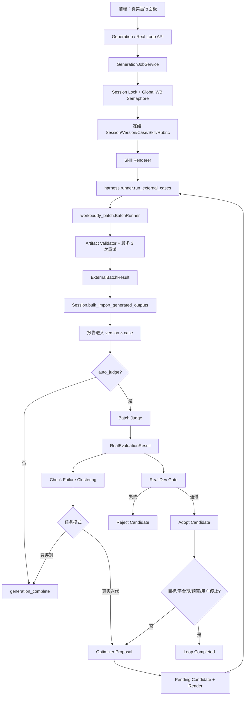
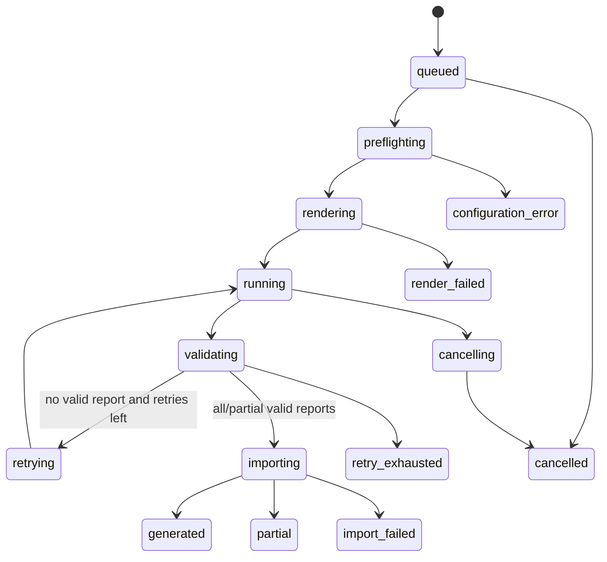
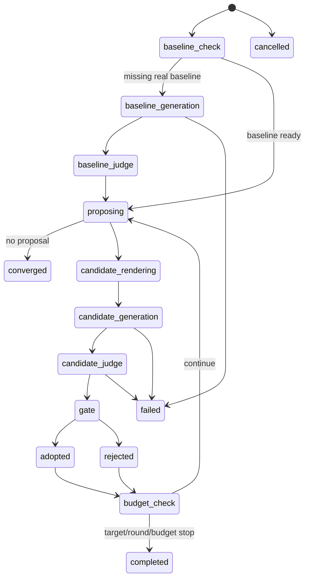

# OpenHarness 前端一键真实 Loop × WB CLI 开发设计

> 状态：Draft
> 日期：2026-07-23
> 范围：设计文档，不包含本轮代码实现
> 目标：用户在 OpenHarness 前端点击一次，即可调用 WB CLI 批量生成当前 Skill 版本的真实报告、自动验收与重试、导入 Session，并逐步衔接自动 Judge、真实 Gate 和连续 Skill 优化。

---

## 1. 结论先行

前端不能直接执行：

```bash
python harness/run_external.py ...
```

正确架构是：

1. 前端只提交结构化任务请求；
2. Server 创建异步 Generation/Loop Job，立即返回 `202`；
3. 后台 Job 调用 OpenHarness `runner.run_external_cases()`；
4. Runner 调用内置 `workbuddy_batch`，完成报告生成、验收和最多 3 次条件重试；
5. 生成成功后，Session 通过批量接口一次性导入所有报告；
6. 前端轮询 Job 状态，展示 case、attempt、Token、错误和报告；
7. 后续自动 Judge 完成后，真实分数才能进入失败聚类和 Gate；
8. 真实候选 Skill 必须先渲染为版本化文件型 WorkBuddy Skill，不能继续使用固定 `research-report` 冒充 v0/v1/vN。

“一键跑 Loop”建议明确拆成三个按钮/模式：

| 模式 | 一次点击做什么 | 推荐阶段 |
|---|---|---|
| 生成并导入当前版本 | WB 生成 → 验收/重试 → 自动导入报告 | 第一阶段，优先实现 |
| 生成并评测当前版本 | 上一步 + 自动逐 check Judge → 真实分数/失败模式 | 第二阶段 |
| 运行一次真实迭代 | 当前版本真实评测 → 生成候选 → 候选真实评测 → Gate → 采纳/拒绝 | 第三阶段 |
| 连续优化至停止 | 重复真实迭代，直到目标/平台期/预算/人工停止 | 最后阶段，高级功能 |

前端可以最终提供一个“连续优化”按钮，但底层必须保留上述可分段状态。不能把分钟级、多模型、多版本任务包装成一个不可观察、不可恢复的同步 HTTP 请求。

---

## 2. 当前系统状态

### 2.1 已经具备的能力

当前已有：

- `harness.runner.run_external_cases()` 统一真实外部执行入口；
- `harness/workbuddy_runner.py` façade；
- `harness/workbuddy_batch/` 多文件 WB 执行实现；
- `ExternalRunRequest` / `ExternalBatchResult`；
- required report Artifact Validator；
- WB `repetition=1`；
- 没有有效报告时 fresh-session 完整重跑，最多额外 3 次；
- 每个 attempt 的 status、trace、manifest、Token 和报告落盘；
- `case.json` 的 WB case ID → OpenHarness case ID 映射；
- 前端创建/恢复 Session、导入数据、导入报告、逐 check 标注和单 case Judge；
- `/api/advance` 一键生成下一版 Skill。

### 2.2 当前前端尚未具备的能力

当前没有：

- Generation Job 数据模型；
- 后台任务调度；
- `/api/generation/*`；
- 前端“生成真实报告”按钮；
- 自动把 Runner 结果批量写入 Session；
- 生成任务进度和 attempt 展示；
- SkillArtifact → WorkBuddy 文件型 Skill Renderer；
- 批量自动 Judge；
- 真实 check 失败聚类；
- 真实候选 Gate；
- 连续真实 Loop。

### 2.3 现有 `/api/advance` 不是一条真实 Loop

当前 `Session.advance()`：

```text
当前 Mock failures
    ↓
optimizer.propose()
    ↓
生成候选 SkillArtifact
    ↓
ResearchMockBackend 跑 dev
    ↓
Mock Judge / Mock Gate
    ↓
采纳或拒绝
```

它没有调用 WB CLI，也没有生成真实报告。

因此不能简单实现：

```text
先点“生成报告”
再自动调用现有 /api/advance
```

否则候选版本仍由 Mock Gate 决定，真实报告只成为页面附件，没有真正进入优化闭环。

---

## 3. 目标架构



### 3.1 分层职责

#### 前端

只负责：

- 选择模式、case 范围、模型和预算；
- 发起任务；
- 轮询状态；
- 展示进度、报告、错误和版本结果；
- 取消/重试；
- 对连续优化做高成本确认。

前端不能提交：

- 任意 dataset 路径；
- 任意 Skill path；
- arbitrary system prompt；
- plugin directory；
- WorkBuddy CLI binary path；
- ground truth；
- 任意本机输出目录。

#### Server API

只负责：

- 鉴权；
- 参数白名单；
- 找到 Session；
- 创建 Job；
- 查询、取消和重试；
- 不直接执行 WorkBuddy subprocess。

#### GenerationJobService

负责：

- 后台线程/worker；
- Session 级互斥；
- 全局并发控制；
- 任务状态转换；
- 调用 Runner；
- 批量导入；
- 可选触发 Judge；
- 落盘与重启恢复。

#### Runner

继续拥有：

- `case.json`；
- WorkBuddy 参数；
- execution directive；
- workspace/session；
- artifact 验收；
- attempt 条件重试；
- provenance。

JobService 不解释 stream-json，也不自己扫描 WB workspace。

#### Session

拥有：

- 当前版本和候选版本；
- OpenHarness case；
- 报告与 Judge 结果；
- 真实评测状态；
- 版本采纳/拒绝；
- 页面 View。

---

## 4. 推荐的用户交互

### 4.1 新增“真实运行”面板

建议放在“版本演进”与当前 Skill 卡片之间：

```text
┌────────────────────────────────────────────┐
│ 真实运行                                   │
│ 当前版本：v3    Skill Hash：a8f...         │
│ Case：全部 Dev（3）                        │
│ 模型：deepseek-v4-pro  并发：3             │
│                                            │
│ [生成并导入当前版本报告]                   │
│ [生成 + 自动 Judge]                        │
│ [运行一次真实迭代]                         │
│ [连续优化…]                                │
│                                            │
│ 状态：generating · attempt 2/4             │
│ case-01  ✓ generated  1 attempt            │
│ case-02  ↻ retrying   artifact_missing     │
│ case-03  … running                         │
│                                            │
│ Token / 耗时 / 报告 / trace                │
│ [取消] [仅重试失败 case]                   │
└────────────────────────────────────────────┘
```

### 4.2 第一阶段主按钮

按钮文案：

```text
▶ 生成并导入当前版本报告
```

点击后的确定语义：

1. 冻结当前 Session 版本；
2. 渲染该版本 Skill；
3. 选择当前范围内的 case；
4. Runner 调用 WB CLI；
5. 无报告自动重试；
6. 成功报告批量导入当前冻结版本；
7. 页面展示“已生成，待 Judge”。

此按钮不自动调用现有 `/api/advance`。

### 4.3 第二阶段按钮

```text
▶ 生成、导入并自动 Judge
```

完成后当前版本的 required cases 必须全部达到：

```text
report_status = generated
judge_status = evaluated
score_source = real
```

才能显示：

```text
当前版本已完成真实评测
```

### 4.4 第三阶段按钮

```text
▶ 运行一次真实迭代
```

一次真实迭代包括：

1. 确保当前版本有完整真实基线；
2. 根据真实失败模式生成候选；
3. 渲染候选 Skill；
4. 在 Dev cases 上生成候选真实报告；
5. 自动 Judge；
6. 用真实分执行 Gate；
7. 采纳或拒绝候选；
8. 停在新当前版本或原版本。

### 4.5 连续优化按钮

```text
▶ 连续优化至目标/平台期
```

必须放在“高级”区域，并二次确认：

- 最大轮数；
- 最大总 Token；
- 最大费用；
- 最大总时长；
- 每个 case 最大 attempt；
- Judge 模型；
- 允许的 case 范围。

默认建议：

```json
{
  "max_rounds": 3,
  "max_wall_time_seconds": 7200,
  "max_report_retries": 3,
  "require_all_dev_cases": true,
  "stop_on_new_red_line": true
}
```

---

## 5. 一键生成并导入的详细流程

### 5.1 点击前预检

Server 在创建 Job 前检查：

1. Session 存在；
2. Session 产品支持真实生成；
3. Session 已导入 cases；
4. 请求 version 存在且仍是用户看到的版本；
5. 没有同 Session 的 active Generation/Loop Job；
6. WB CLI 可发现；
7. dataset 配置存在；
8. 所有 case mapping 完整；
9. 所有 input source 存在且在 allowlist；
10. 当前 Skill 可渲染；
11. 输出目录可写；
12. 模型、并发、重试值在平台上限内。

预检失败返回 `400/409`，不启动 Job，不消耗模型。

### 5.2 版本冻结

Job 创建时必须冻结：

- `session_id`；
- `version`；
- `SkillArtifact` snapshot；
- Skill hash；
- rubric version/hash；
- OpenHarness case IDs；
- WB case IDs；
- dataset hash；
- 材料 hash；
- 模型和 effort；
- output contract；
- retry policy；
- 触发账号。

即使用户在任务运行中切换页面版本，结果仍回写到冻结 version，不能写到“当前版本”这个动态指针。

### 5.3 Runner 执行

JobService 构造：

```python
ExternalRunRequest(
    session_id=session.id,
    skill_version=frozen_version,
    case_file=server_config.wb_dataset,
    output_root=server_config.generation_root,
    skill_path=rendered_skill_path,
    model=request.model,
    parallel=request.parallel,
    max_report_retries=request.max_report_retries,
    output_contract=ReportOutputContract(
        required_glob="deliverables/report.md",
        allowed_extensions=(".md",),
        min_bytes=500,
        max_files=1,
    ),
)
```

调用：

```python
result = runner.run_external_cases(external_request)
```

### 5.4 批量导入

不能循环调用当前 `Session.import_output()`：

```python
for result in results:
    session.import_output(...)
```

因为当前方法每个 case 都会：

- append output；
- append event；
- `evaluate()`；
- `_save()`。

三个 case 会重复重评三次；case 数量变大后开销和并发风险会放大。

建议新增：

```python
def import_generated_outputs(
    self,
    *,
    version: str,
    outputs: dict[str, GeneratedOutput],
    generation_id: str,
    account: str,
) -> dict:
    """原子批量导入，只 evaluate/save 一次。"""
```

流程：

1. 检查 version 仍存在；
2. 检查所有 OpenHarness case ID；
3. 对每个报告追加 immutable generation reference；
4. 把报告文本写入 `report_outputs[version][case_id]`；
5. 批量持久化；
6. append 一个 `generation_imported` 事件；
7. `evaluate()` 一次；
8. `_save()` 一次。

### 5.5 部分成功

建议：

- 成功 case 自动导入；
- 失败 case 保留完整 attempt；
- Job 状态为 `partial`；
- version 状态为 `generation_partial`；
- 提供“仅重试失败 case”；
- 真实评测和 Gate 默认要求全部 Dev case 成功；
- 不允许拿成功子集静默计算 Gate。

---

## 6. Skill Renderer 是真实 Loop 的前置依赖

当前：

```text
OpenHarness v0/v1/vN = SkillArtifact JSON
WorkBuddy 执行 = 文件型 research-report Skill
```

如果所有版本都传：

```text
skills/research-report
```

那么 v0、v1、v15 实际执行的是同一个固定 Skill。真实报告分数变化无法归因，Loop 无效。

必须新增：

```text
SkillArtifact
    ↓
ResearchReportSkillRenderer
    ↓
app/sessions/<sid>/skill_snapshots/<version>/<hash>/
    ├── SKILL.md
    └── references/
        └── instructions.md
```

Renderer 要求：

- 同一 SkillArtifact 输出稳定内容和 hash；
- structure 映射到 flow/subagent；
- directives 只渲染当前打开项；
- few-shot 和 memory 按版本渲染；
- snapshot 不可变；
- Job 记录 snapshot hash；
- 候选即使被拒也保留；
- Runner 只接收 Renderer 输出路径；
- 不能读取机器上同名已安装 Skill 代替。

在 Renderer 完成前，前端可以提供：

```text
生成固定 research-report 报告（链路验证）
```

但不能把按钮命名为：

```text
运行当前版本真实 Loop
```

---

## 7. 自动 Judge 与真实评测

### 7.1 当前 Judge 的限制

当前 `/api/run_judge`：

- 单 case；
- 同步 HTTP；
- 直接调用外部 Judge；
- 完成后立即 `set_judge_checks()` 和重评；
- 不适合一批 cases 和连续版本。

### 7.2 建议新增 Batch Judge

```python
class BatchJudgeService:
    def evaluate(
        session_id,
        version,
        generated_outputs,
        rubric_snapshot,
        cases,
    ) -> BatchJudgeResult:
        ...
```

要求：

- 每 case 独立状态；
- Judge 并发上限；
- 超时和重试与报告生成分开；
- Judge 模型与生成模型分别记录；
- ground truth 只进入 Judge，不进入 WB；
- 支持 Fake Judge 契约测试；
- 批量写入 `judge_checks`；
- 全批完成后只重评一次。

### 7.3 禁止 Mock 分回退

当前 `_apply_recorded()` 的行为是：

```text
有真实报告但没有真实 Judge
    → 保留 Mock 分
```

一键真实 Loop 中必须改成：

```text
有真实报告但没有真实 Judge
    → judge_pending
    → 不进入真实均分、失败聚类或 Gate
```

建议分别维护：

- `mock_eval`：原有离线演示；
- `real_eval`：只统计 `generated + evaluated`；
- 页面明确显示数据源；
- Real Gate 只能读取 `real_eval`。

---

## 8. 真实失败聚类

当前 `clustering.cluster()` 依赖 Mock `signals`。

真实报告：

```python
signals = {}
```

因此真实 Loop 不能继续直接使用当前 clustering。

建议新增：

```text
harness/check_clustering.py
```

输入：

```json
{
  "case_id": "rr-ds-timelen",
  "checks": {
    "T1": 1,
    "T2": 0,
    "S1": 0.5
  },
  "reasoning": {}
}
```

输出与当前 optimizer 兼容：

```json
{
  "pattern_id": "check-T2",
  "pattern": "存在编造或无法回溯内容",
  "affected_dims": ["traceability"],
  "directive_hint": "verify_no_fabrication",
  "hit_count": 2,
  "severity": "redline"
}
```

需要一个冻结的：

```text
check ID → failure pattern → directive/few-shot hint
```

registry。该 registry 是 Rubric、Judge、Optimizer 之间的跨模块契约，修改必须单独 review。

---

## 9. 真实候选 Gate

### 9.1 不复用现有 Mock Gate

建议新增独立方法：

```python
Session.advance_real(...)
```

或独立服务：

```python
RealLoopService.run_iteration(...)
```

不要给现有 `advance()` 加大量条件分支。

### 9.2 候选状态

当前版本列表只有：

- adopted；
- rejected。

真实异步 Gate 需要：

- `pending`；
- `rendering`；
- `generating`；
- `judge_pending`；
- `gate_ready`；
- `adopted`；
- `rejected`；
- `failed`；
- `cancelled`。

候选在 Gate 前不能成为 `current_version`。

### 9.3 版本 ID

当前 `advance()` 用 adopted 数量计算下一个 `vN`。真实异步链路中可能出现：

- rejected candidate；
- cancelled candidate；
- failed candidate；
- 并发启动。

不能继续只用 adopted 数量推版本号，否则可能重复生成相同 `vN`。

建议：

- adopted 版本仍为 `v0/v1/v2`；
- 候选先使用不可重复 ID：
  `cand-<parent>-<sequence>-<uuid>`；
- Gate 通过后分配下一个 adopted `vN`；
- 所有报告、Judge、Skill snapshot 先关联 candidate ID；
- 采纳时建立 alias/血缘，不移动原始产物。

### 9.4 Gate 条件

默认真实 Dev Gate：

1. required Dev cases 100% generated；
2. required Dev cases 100% judged；
3. 目标维度至少一个提升；
4. 非目标维度回退不超过 tolerance；
5. 不新增红线；
6. 真实 overall 不下降；
7. Skill hash 与候选一致；
8. dataset/rubric/material hash 与基线一致。

Test split 只在采纳后按 `test_every` 执行，不能在每次提案时泄漏给 Optimizer。

---

## 10. 状态机

### 10.1 Generation Job



### 10.2 Real Loop Job



---

## 11. API 设计

### 11.1 生成并导入

```http
POST /api/generation/start
```

请求：

```json
{
  "id": "research-run",
  "version": "v3",
  "case_ids": [
    "rr-ds-timelen",
    "rr-surge-eff",
    "rr-retention"
  ],
  "model": "deepseek-v4-pro",
  "parallel": 3,
  "max_report_retries": 3,
  "auto_judge": false,
  "idempotency_key": "ui-..."
}
```

返回：

```json
{
  "generation_id": "gen-...",
  "status": "queued"
}
```

### 11.2 查询

```http
GET /api/generation?id=gen-...
```

返回：

```json
{
  "generation_id": "gen-...",
  "session_id": "research-run",
  "version": "v3",
  "status": "running",
  "phase": "workbuddy",
  "created_at": "...",
  "elapsed_seconds": 261,
  "cases": [
    {
      "case_id": "rr-ds-timelen",
      "wb_case_id": "case-01-ds-duration",
      "status": "generated",
      "attempt": 1,
      "max_attempts": 4,
      "report_imported": true
    },
    {
      "case_id": "rr-surge-eff",
      "status": "retrying",
      "attempt": 2,
      "last_error": "artifact_missing"
    }
  ]
}
```

### 11.3 重试失败 case

```http
POST /api/generation/retry
```

```json
{
  "id": "gen-...",
  "failed_only": true,
  "idempotency_key": "ui-..."
}
```

创建新 generation/attempt，不覆盖旧记录。

### 11.4 取消

```http
POST /api/generation/cancel
```

取消必须向 Runner/BatchRunner 传递 cancel token，并终止对应 WorkBuddy 进程组。

### 11.5 真实迭代

```http
POST /api/real_loop/start
```

```json
{
  "id": "research-run",
  "mode": "one_iteration",
  "model": "deepseek-v4-pro",
  "judge_model": "claude-opus-4-8",
  "parallel": 3,
  "max_report_retries": 3,
  "require_all_dev_cases": true,
  "idempotency_key": "ui-..."
}
```

连续优化：

```json
{
  "mode": "until_stop",
  "max_rounds": 3,
  "max_wall_time_seconds": 7200,
  "max_total_tokens": 1000000
}
```

---

## 12. 数据契约

### 12.1 GenerationJob

至少包含：

- generation ID；
- session/version/candidate；
- frozen Skill/Rubric/Dataset hash；
- case IDs；
- model/parallel/timeout/retry；
- status/phase；
- owner account；
- idempotency key；
- created/started/finished；
- cancel requested；
- per-case attempt；
- output/trace references；
- import status；
- Judge status。

### 12.2 Version Real Run State

建议 Session View 新增：

```json
{
  "real_run": {
    "version": "v3",
    "generation_status": "generated",
    "judge_status": "evaluated",
    "required_cases": 3,
    "generated_cases": 3,
    "evaluated_cases": 3,
    "generation_id": "gen-...",
    "skill_sha256": "...",
    "dataset_sha256": "...",
    "rubric_sha256": "...",
    "real_scores": {},
    "real_failures": []
  }
}
```

### 12.3 结果幂等

批量导入 key：

```text
session_id + version/candidate_id + case_id + generation_id + report_sha256
```

重复回调不得：

- 重复 append report；
- 重复 Judge；
- 重复采纳版本；
- 把旧 Job 覆盖到新版本。

---

## 13. 持久化

建议：

```text
app/sessions/<sid>/
├── generation_jobs.jsonl
├── generation_results.jsonl
├── real_loop_jobs.jsonl
├── generated_outputs.jsonl
├── real_evaluations.jsonl
├── candidate_versions.jsonl
├── skill_snapshots/
└── generation_refs/
```

已有 `outputs.jsonl` 可继续作为兼容视图，但生成链路需要额外 provenance：

- generation ID；
- attempt；
- report hash；
- Skill hash；
- dataset/material hash；
- WB run/session；
- model；
- trigger account；
- trace path。

Server 重启策略：

- completed/failed/cancelled 直接恢复；
- queued 可重新入队；
- running 不自动假设仍存活；
- 如果无法确认原 WorkBuddy 进程，标记 `interrupted`；
- 用户点击“重试”创建新 Job；
- 不使用旧 session `--resume` 继续未知现场。

---

## 14. 并发与锁

最低要求：

### Session 锁

同一 Session 同时只允许：

- 一个 active Generation Job；或
- 一个 active Real Loop Job。

报告导入、Judge 写入、版本采纳都在 Session 锁内完成。

### 全局 WorkBuddy 信号量

避免多个用户各自 `parallel=3` 导致机器实际并发失控：

```text
用户请求 parallel
    ↓
min(用户值, 单任务上限, 全局剩余槽位)
```

### 版本乐观校验

Job 创建时记：

```text
expected_current_version
```

导入或采纳前校验：

- 如果只是生成当前版本，结果仍可写入冻结 version；
- 如果要推进 Loop，而 current version 已被其他任务改变，则 Job 标记 `stale`，不得 Gate/采纳。

### 防重复点击

- 点击后立即 disable；
- 请求带 idempotency key；
- Server 对相同 key 返回同一个 Job；
- Session active job 冲突返回 `409`。

---

## 15. 建议新增模块

### app

| 文件 | 职责 |
|---|---|
| `app/generation_models.py` | Job/Loop/Case 状态数据结构 |
| `app/generation_jobs.py` | 后台队列、线程、取消、恢复、查询 |
| `app/session_generation.py` | SessionGeneration mixin；批量导入、真实运行状态 |
| `app/skill_renderer.py` | SkillArtifact → 文件型 WorkBuddy Skill |
| `app/batch_judge.py` | 批量真实 Judge |
| `app/real_loop.py` | 一次/连续真实迭代编排 |

### harness

| 文件 | 职责 |
|---|---|
| `harness/check_clustering.py` | check 失败 → optimizer failure_report |
| `harness/artifacts/check_directive_registry_research.json` | check → pattern → directive 契约 |

### 修改文件

| 文件 | 修改 |
|---|---|
| `app/session.py` | 组合 SessionGeneration |
| `app/session_core.py` | snapshot/view 增加 generation/real run refs |
| `app/session_eval.py` | 增加 real_eval，禁止真实线 Mock 回退 |
| `app/persistence.py` | Job/结果/candidate/provenance 落盘 |
| `app/server.py` | Generation/Real Loop 薄路由 |
| `app/index.html` | 真实运行面板 |
| `app/app.js` | 启动、轮询、取消、重试和状态渲染 |
| `MODULES.md` | 登记 M3/M7 和新 API 契约 |

---

## 16. 本地部署配置

Server 使用环境配置，不从前端接收本机路径：

```bash
export OPENHARNESS_WB_DATASET="/Users/zhangsijing/Desktop/Coding/research_agent/case.json"
export OPENHARNESS_WB_OUTPUT_ROOT="/Users/zhangsijing/Desktop/Coding/research_agent/OpenHarness/generation_runs"
export OPENHARNESS_WB_SKILL_ROOT="/Users/zhangsijing/Desktop/Coding/research_agent/OpenHarness/app/sessions"
export OPENHARNESS_WB_MODEL="deepseek-v4-pro"
export OPENHARNESS_WB_PARALLEL="3"
export OPENHARNESS_WB_MAX_REPORT_RETRIES="3"
export OPENHARNESS_WB_TIMEOUT_SECONDS="900"
export OPENHARNESS_WB_STALL_TIMEOUT_SECONDS="180"

cd /Users/zhangsijing/Desktop/Coding/research_agent/OpenHarness/app
python3 server.py --host 127.0.0.1 --port 8080
```

生产环境再增加：

- iOA 鉴权；
- 角色 allowlist；
- 独立执行账号/容器；
- 全局并发/Token/费用配额；
- 输出保留期；
- Judge 密钥；
- 受控 WorkBuddy CLI 路径。

---

## 17. 系统冲突与风险

| ID | 冲突 | 后果 | 设计处理 |
|---|---|---|---|
| R01 | HTTP 请求同步跑 WB | 页面超时、Server 线程占用 | 后台 Job + `202` + polling |
| R02 | 当前 `/api/advance` 是 Mock Gate | “真实 Loop”实际仍由 Mock 决策 | 新增独立 RealLoopService |
| R03 | 固定 `research-report` 与 vN SkillArtifact 不同 | 版本分数不可归因 | Renderer + Skill hash |
| R04 | 有真实报告无 Judge 时回退 Mock | 真实曲线和 Gate 被污染 | `judge_pending`，real_eval 排除 |
| R05 | 真实报告没有 Mock signals | Optimizer 直接收敛 | check clustering + registry |
| R06 | 逐 case 调 `import_output()` | 重复重评、重复保存、竞争写 | 批量原子导入 |
| R07 | Job 运行时页面版本改变 | 报告写入错误版本 | 冻结 version，导入按冻结 ID |
| R08 | 多任务同时改 Session | 状态覆盖/版本血缘损坏 | Session 锁 + active job 约束 |
| R09 | `parallel` 只限制单任务 | 多用户总并发过载 | 全局 semaphore |
| R10 | 页面重复点击 | 重复成本、重复报告 | idempotency key + `409` |
| R11 | 部分 case 成功 | 成功子集导致虚高 Gate | import 可部分；Gate 默认要求 100% Dev |
| R12 | Server 重启 | 内存 Job 丢失 | Job 落盘；running → interrupted |
| R13 | 取消只改 UI 状态 | WorkBuddy 子进程继续花钱 | cancel token + 进程组终止 |
| R14 | rejected/failed candidate 占用版本号 | vN 重复或覆盖 | candidate ID 与 adopted version 分离 |
| R15 | Judge 并发/限流 | 全批失败或阻塞 | 独立 Judge 队列、重试、限流 |
| R16 | ground truth 进入 WB | 评测答案泄漏 | 生成 payload 白名单；Judge 单独读取 |
| R17 | Test split 每轮参与提案 | 过拟合/held-out 泄漏 | Dev Gate；Test 仅采纳后按周期执行 |
| R18 | 连续 Loop 成本不可控 | Token/时延放大 | max rounds/time/tokens/cost |
| R19 | 本地 `bypassPermissions` | 页面触发高权限 Agent | 本地仅可信用户；生产隔离/allowlist |
| R20 | 旧 Job 完成回调晚于新 Job | 旧结果覆盖新状态 | generation/version/hash 乐观校验 |

---

## 18. 分阶段开发计划

### Phase A：当前版本一键生成并导入

目标：

```text
前端点击 → WB 批量生成 → 验收/重试 → 自动导入 → 页面显示报告
```

工作：

- GenerationJob 数据契约；
- persistence；
- JobService；
- SessionGeneration mixin；
- 批量导入；
- `/api/generation/start` 和查询；
- 前端按钮和 polling；
- active job 锁；
- 固定 Skill 模式可以作为链路验证，但 UI 必须明确标识。

验收：

- HTTP 立即返回 `202`；
- 页面不冻结；
- 三个 case 状态实时更新；
- 成功报告自动出现在现有报告区域；
- 无报告最多重试 3 次；
- 失败 case 可单独重试；
- Server 重启可看到已完成历史；
- 不触发 Judge 和版本推进。

### Phase B：版本化 Skill Renderer

目标：确保 v0/v1/vN 实际执行不同 Skill。

验收：

- 同一 Artifact hash 稳定；
- directive 切换导致 snapshot 内容/hash 改变；
- Job 记录 hash；
- 旧 snapshot 不被覆盖；
- 固定 Skill 不再用于真实版本 Gate。

### Phase C：批量自动 Judge 与 real_eval

工作：

- Batch Judge；
- Judge Job；
- 批量写入 checks；
- `judge_pending`；
- real_eval；
- 禁止 Mock fallback；
- check clustering。

验收：

- 所有成功报告自动 Judge；
- ground truth 仅进入 Judge；
- 某 case Judge 失败不污染其他 case；
- 页面区分 generated/judge_pending/evaluated；
- 真实均分只统计 evaluated；
- 真实失败模式能给 Optimizer。

### Phase D：一次真实迭代

工作：

- pending candidate；
- candidate ID；
- RealLoopService；
- candidate Renderer；
- candidate Dev 生成/Judge；
- Real Gate；
- adopt/reject；
- 前端“一次真实迭代”。

验收：

- candidate Gate 不使用 Mock 分；
- 采纳后 current version 才变化；
- 拒绝候选保留产物和 trace；
- 并发/stale Job 不得采纳；
- 新红线一票否决。

### Phase E：连续真实 Loop

工作：

- max rounds/time/token/cost；
- pause/cancel；
- stop reasons；
- Test 周期；
- 预算面板；
- 连续版本时间线。

验收：

- 目标达成停止；
- 无 proposal 停止；
- 平台期停止；
- 预算停止；
- 用户取消停止；
- Server 重启后状态可解释；
- 不重复执行已完成版本。

---

## 19. 测试计划

### 单元测试

- Generation/Loop 状态转换；
- idempotency；
- Session 锁；
- batch import 只 evaluate 一次；
- version freeze；
- candidate ID 唯一；
- real_eval 无 Mock fallback；
- check → directive mapping；
- Renderer hash；
- budget stop。

### Fake WorkBuddy 契约测试

- 全部一次成功；
- 某 case 第 4 次成功；
- 某 case retry_exhausted；
- partial；
- CLI error；
- timeout/stalled；
- 取消；
- Server 重启后结果恢复；
- 旧 Job 晚回调；
- 报告生成成功但版本/hash 不匹配。

### Fake Judge

- 全成功；
- 单 case 失败重试；
- 非 JSON；
- timeout/限流；
- ground truth 未进入 WB；
- 逐 check 聚类稳定。

### 前端

- 按钮 disable；
- polling；
- 刷新页面恢复 Job；
- partial/error 展示；
- failed-only retry；
- cancel；
- 版本切换时仍展示冻结 Job；
- `node --check app/app.js`。

### 回归

- `harness/run_demo_research.py`；
- `harness/run_demo.py`；
- 现有人工上传；
- 单 case 手动 Judge；
- `Session.restore()`；
- 页面创建/打开/推进旧会话。

---

## 20. 推荐 PR 顺序

1. `[contract] generation/real-loop models + API + persistence`
2. `Skill Renderer + hash fixtures`
3. `GenerationJobService + Session bulk import`
4. `Generation API`
5. `真实运行前端面板`
6. `Batch Judge + real_eval`
7. `Check clustering registry`
8. `One-iteration RealLoopService`
9. `Continuous Loop + budgets/cancel`

每个 PR 都保持可单独回归；不要在一个 PR 同时重写 Session、Server、Runner、Judge 和前端。

---

## 21. 推荐落地决策

为尽快得到可用能力，推荐：

1. 第一版前端只上线“生成并导入当前版本报告”；
2. 同期完成 Renderer，避免固定 Skill 与版本错配；
3. 报告成功后先停在 `judge_pending`；
4. 第二版接批量自动 Judge；
5. 第三版上线“运行一次真实迭代”；
6. 连续自动优化最后上线，并默认限制 3 轮；
7. 现有 Mock `advance` 保留，按钮明确标为“Mock 优化推进”；
8. 新增独立“真实运行/真实迭代”入口，绝不静默混用两套 Gate。

这样用户最早可以获得：

```text
一个按钮 → 三个真实 case 自动生成 → 缺报告自动重试 → 自动导入页面
```

同时系统不会提前声称已经完成真实 Skill 优化闭环。
